# networking

## OSI Model

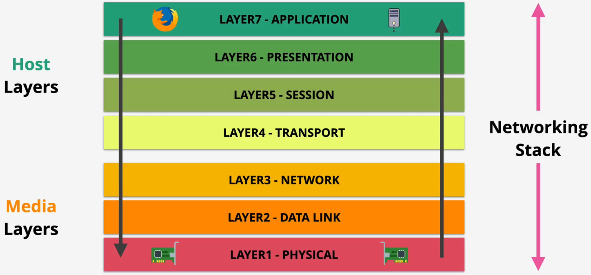

Components

- Local networking - Ethernet
- Routing
- Segmenting, ports and sessions
- Applications

Key features

- Higher layer built on lower layer, adding features and capabilities
- This bottom-up approach illustrates the limitations of each lower layer and how each subsequent upper layer was developed to address and overcome those limitations

### Layer 1 - Physical - Bit

Key features

- Layer 1 (Physical) specifications define the transmission and reception of raw bit streams between a device and a shared physical medium
- It defines things like voltage levels, timing, rates, distances, modulation, and connectors
- Physical medium can be copper (electrical), fibre (light), or wifi (RF)

Physical HUB

- Connects two more devices

Combinations

- We can mix and match multiple components depending on the network's needs
  - Cables and NICs
  - Cables and transceivers
  - Cables and repeaters and hubs
  - Cables and wireless access points

Summary

- Physical shared medium
- Standards for transmitting onto the medium
- Standards for receiving from the medium
- No access control
- No uniquely identified devices
- No devices &rarr; Device communications

### Layer 2 - Data Link - Frame

Components on frame

- Preamble and SFD: Define the start of the frame
- MAC header: Contains the destination and source MAC addresses and the EtherType field (layer 3 protocol)
- Payload: The data encapsulated within the frame
- FCS: Check to detect any transmission errors

CSMA/CD - Carrier-sense Multiple Access / Collision Detection

- Challenge

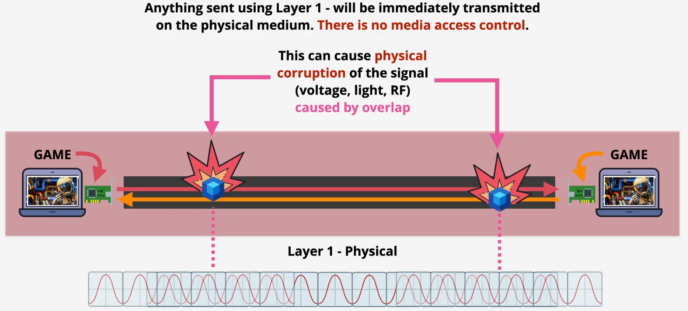

- Solution

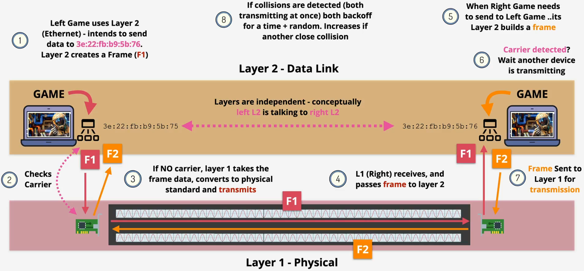

Switch - Layer 2 device

- The NIC handles the conversion of a structured frame (Layer 2) into raw bits encoded as physical signals (Layer 1) for transmission
- Problem

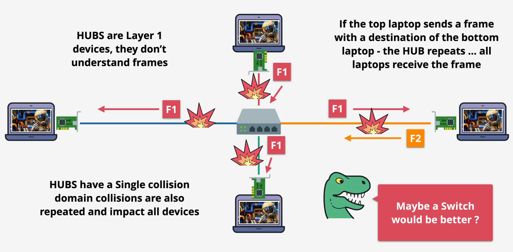

- Solution

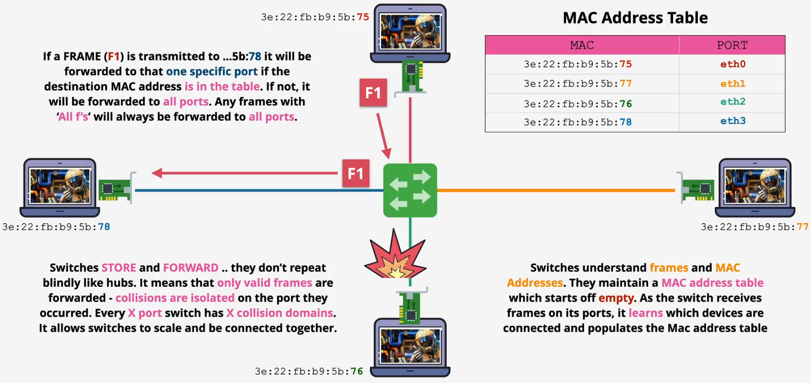

Summary

- Identifiable devices
- Media access control (sharing)
- Collision detection
- Unicast 1:1
- Broadcast 1:ALL
- Switches - Like Hubs with Super powers (Layer 2)

### Layer 3 - Network - Packet

Decimal and binary

- Human vs computer

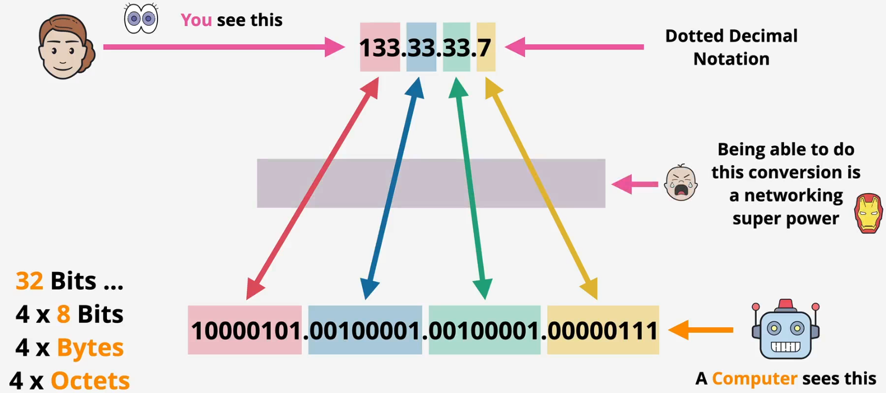

- Conversion: Decimal to binary

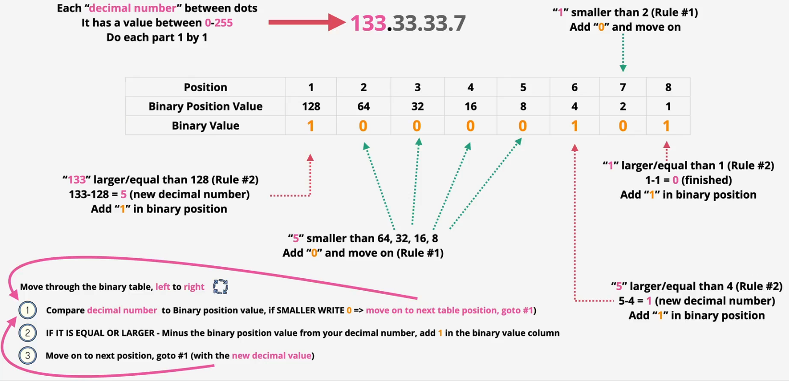

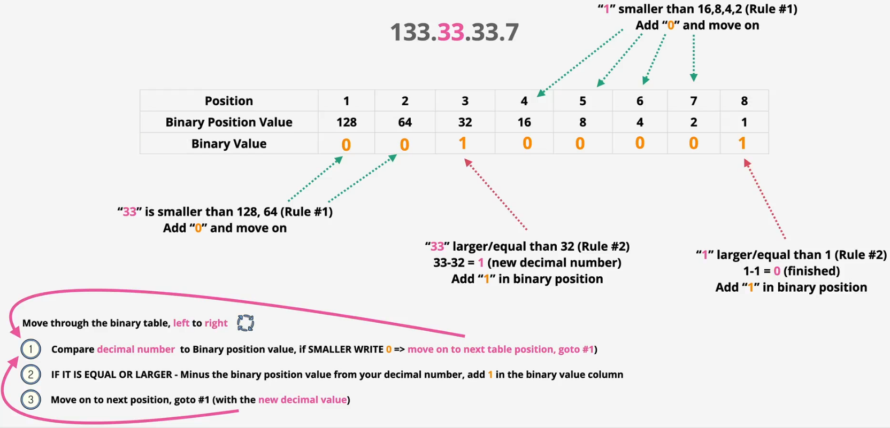

- Conversion: Binary to decimal

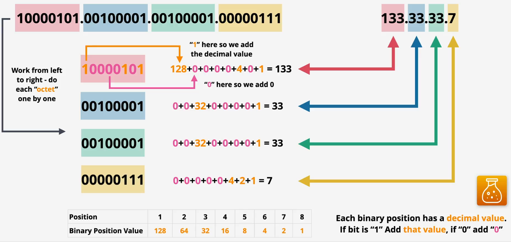

Layer 3

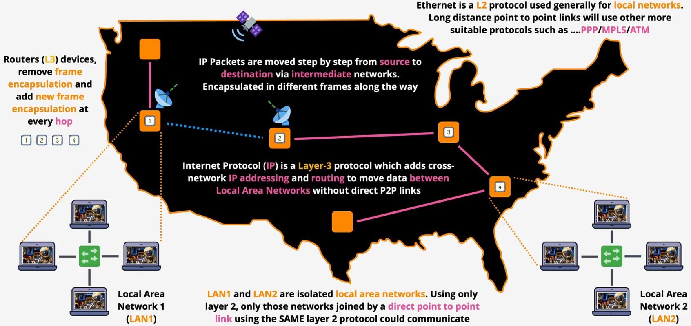

IPv4 and IPv6

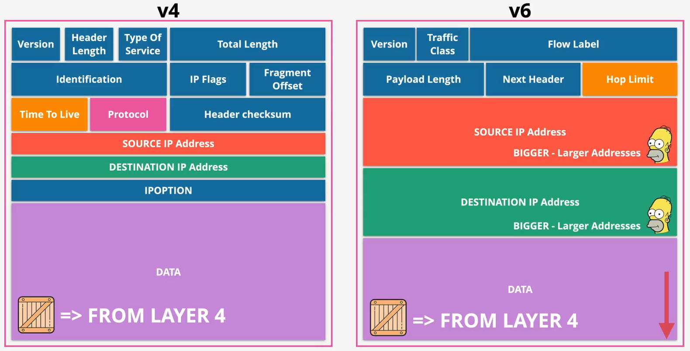

- IPv4

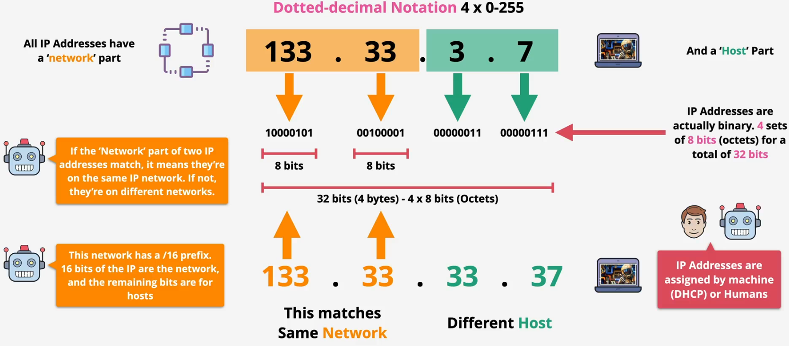

Subnet mask

- /16 in CIDR notation means the first 16 bits of an IP address are the network portion

Route tables and routes

- Each router typically has a single routing table

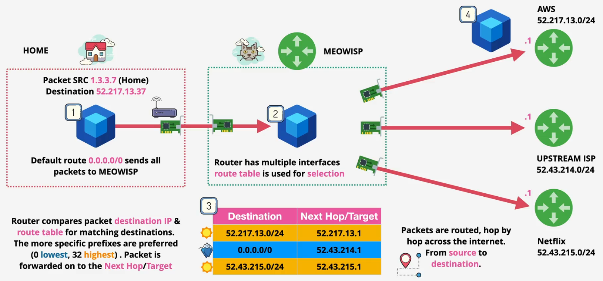

Address resolution protocol (ARP)

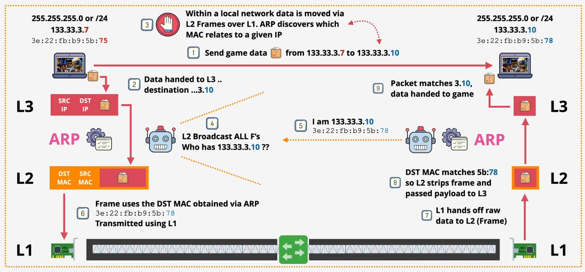

How routing works?

- During routing, the IP packet's core content (source/destination IP, payload) typically remains unchanged, but fields like TTL and checksum are modified
- Routers work at layer 3 but need MACs for layer 2
- MAC address is in frame header, not packet

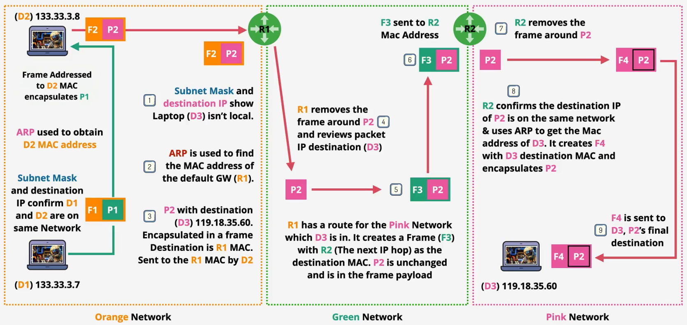

Summary

- IP addresses (IPv4/IPv6) enable cross-network addressing
- ARP maps an IP address to its corresponding MAC address
- A route determines where to forward a packet
- Routing tables store multiple routes for packet forwarding
- Routers move packets, encapsulated in Layer 2 frames
- Devices communicate over the Internet using IP addresses
- IP uses source and destination IP addresses for communication
- IP packets may be delivered out of order

### Layer 4 - Transport - Segment - Continue here 0033

Problems

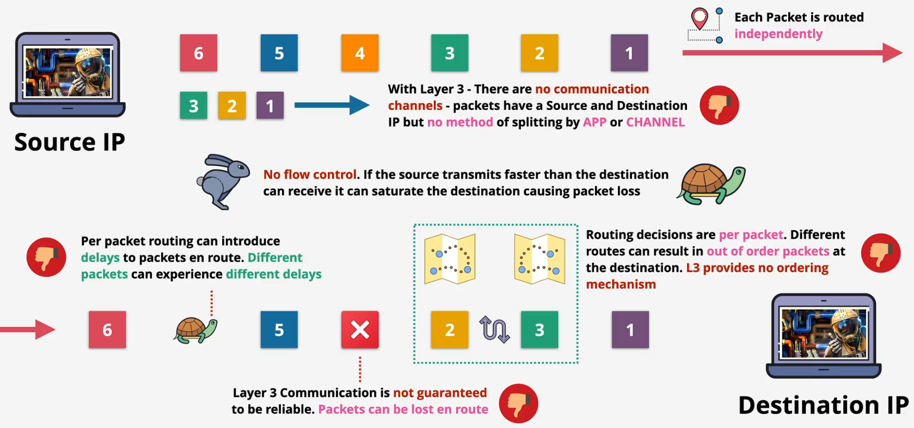

TCP and UDP

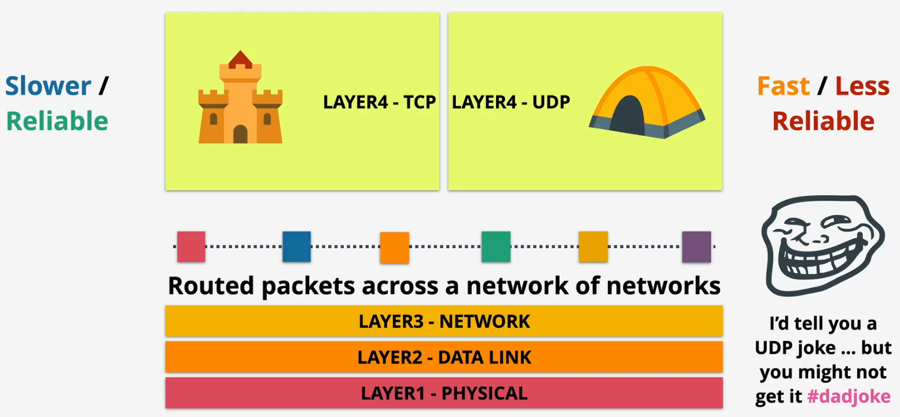

- TCP segments

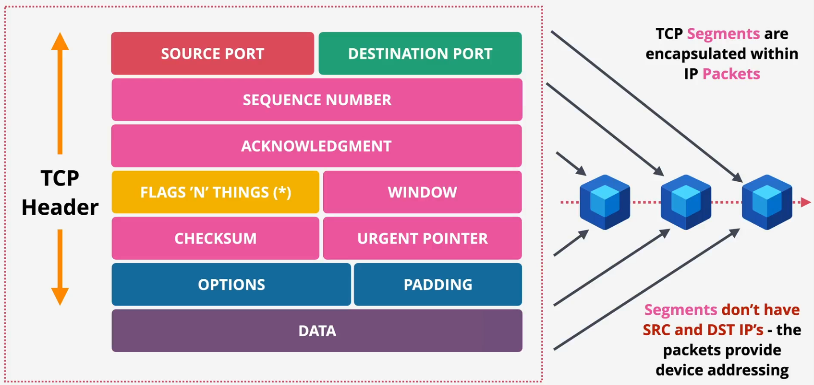

- TCP

### Layer 5 - Session

TCP connection 3-way handshake

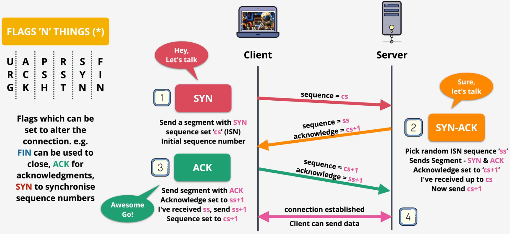

Session and state

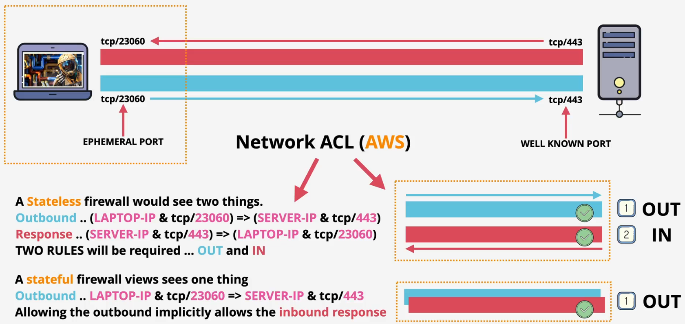
