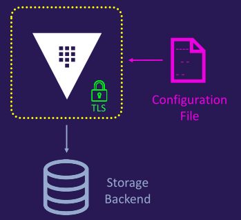
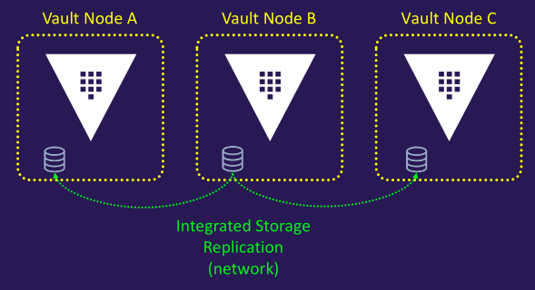
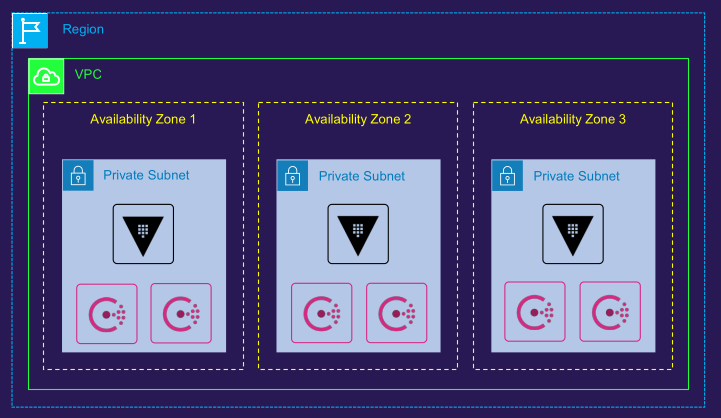
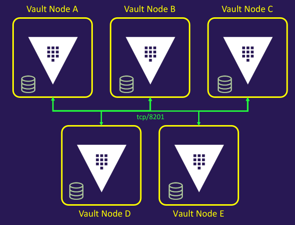

# install vault

## Installing Vault Server

Installing Vault

- Vault is a platform-agnostic tool, meaning it can operate on a variety of underlying platforms, including
  - Kubernetes
  - Cloud-based machines (e.g., AWS instances, Azure virtual machines)
  - VMware virtual machines
  - Physical servers
  - Laptops
- Vault is also compatible with multiple operating systems, such as: macOS, Windows, Linux, FreeBSD, NetBSD, OpenBSD, Solaris, etc.
- To install and set up Vault, follow this order of operations
  - Install Vault
  - Create a configuration file
  - Initialize Vault
  - Unseal Vault
- Where to download Vault
  - vaultproject.io
  - releases.hashicorp.com/vault
  - Alternatively, use your preferred package manager (e.g., apt, yum, or even homebrew—community-supported)
  - For Kubernetes, use the Vault Helm Chart to install and configure Vault
- Installation steps
  - Download Vault
  - Unpackage Vault
  - Set the Path

## Running Vault Dev Server

Running Vault dev server

- Key features
  - Requires no configuration
  - Automatically initializes and unseals Vault
  - Enables the user interface (UI), accessible at localhost
  - Provides an unseal key
  - Automatically logs in as the root user
  - Runs in non-persistent mode (data is stored in memory only)
  - Operates without TLS (insecure)
  - Sets the listener to 127.0.0.1:8200
  - Mounts a Key/Value (K/V) version 2 secret engine
  - Generates a root token

:::warning
Never use the dev server mode in a production environment due to its lack of persistence and security
:::

- Uses cases
  - Proof-of-concept projects
  - Developing and testing new integrations
  - Exploring and testing Vault's new features
  - Experimenting with Vault functionality

To start the Vault dev server, use the following command

```bash
vault server -dev
```

## Running Vault Server in Production

Guidelines

- Deploy one or more persistent Vault nodes using a configuration file
- Select a storage backend that meets Vault's requirements (e.g., Consul, integrated storage, or other supported options)
- Configure multiple Vault nodes to form a cluster
- Deploy Vault nodes close to your applications to minimize latency
- Automate Vault provisioning for efficiency in most production scenarios
- Start the Vault server with the command

```bash
vault server -config=<file>
```

- Use a service manager (e.g., systemctl on Linux, Windows Service Manager) to execute and manage the Vault service in a production environment
- For Linux systems, create a systemd service file to manage Vault (and Consul, if applicable)

System configuration files

- Vault Service: [vault.service](https://github.com/btkrausen/hashicorp/blob/master/vault/config_files/vault.service)
- Consul Server: [vault.service](https://github.com/btkrausen/hashicorp/blob/master/consul/consul.service)
- Consul Client (running on the Vault node): [vault.service](https://github.com/btkrausen/hashicorp/blob/master/vault/config_files/consul-client.json)

Deployment architecture



- Single node
  - No redundancy
  - No scalability
  - Not suitable for production use



- Multi-Node Vault cluster (with integrated storage)


- Multi-Node Vault cluster (with external storage backend)

Step-by-step manual installation

- Download Vault
- Unpackage Vault
- Set the path
- Add and customize configuration file
- Create a systemd service file
- Download Consul
- Configure and join Consul cluster
- Launch Vault service

## Configuring the Consul Storage Backend

Key features

- Provides durable key/value (K/V) storage for Vault data
- Allows independent scaling of the backend
- Simplifies automation
- Features built-in integration between Consul and Vault
- Supports high availability
- Operates as a distributed system
- Includes built-in snapshots for data retention
- Supported by HashiCorp

Consul cluster configuration

- Deploy Consul across multiple nodes, configured as a cluster
- Use an odd number of nodes (e.g., 3, 5, 7) to ensure a majority for leader election
- Replicate all data across every node in the cluster
- Conduct a leader election to designate one Consul node as the leader
- The leader accepts new log entries and replicates them to all other nodes

:::note
In a production environment, avoid using the Consul cluster for both Vault storage and other Consul functions
:::

Architecture diagram



- Consul storage backend communication


- Visualization of Consul cluster

Example configuration files

- Vault configuration file (with Consul storage backend)

```bash
storage "consul" {
  address = "127.0.0.1:8500"
  path    = "vault/"
  token   = "1a2b3c4d-1234-abdc-1234-1a2b3c4d5e6a"
}

listener "tcp" {
  address                  = "0.0.0.0:8200"
  cluster_address          = "0.0.0.0:8201"
  tls_disable              = 0
  tls_cert_file            = "/etc/vault.d/client.pem"
  tls_key_file             = "/etc/vault.d/cert.key"
  tls_disable_client_certs = "true"
}

seal "awskms" {
  region     = "us-east-1"
  kms_key_id = "12345678-abcd-1234-abcd-123456789101"
  endpoint   = "example.kms.us-east-1.vpce.amazonaws.com"
}

api_addr     = "https://vault-us-east-1.example.com:8200"
cluster_addr = "https://node-a-us-east-1.example.com:8201"
cluster_name = "vault-prod-us-east-1"
ui           = true
log_level    = "INFO"
```

- Consul server configuration file in Consul node

```bash
{
  "log_level": "INFO",
  "server": true,
  "key_file": "/etc/consul.d/cert.key",
  "cert_file": "/etc/consul.d/client.pem",
  "ca_file": "/etc/consul.d/chain.pem",
  "verify_incoming": true,
  "verify_outgoing": true,
  "verify_server_hostname": true,
  "ui": true,
  "encrypt": "xxxxxxxxxxxxxx",
  "leave_on_terminate": true,
  "data_dir": "/opt/consul/data",
  "datacenter": "us-east-1",
  "client_addr": "0.0.0.0",
  "bind_addr": "10.11.11.11",
  "advertise_addr": "10.11.11.11",
  "bootstrap_expect": 5,
  "retry_join": ["provider=aws tag_key=Environment-Name tag_value=consul-cluster region=us-east-1"],
  "enable_syslog": true,
  "acl": {
    "enabled": true,
    "default_policy": "deny",
    "down_policy": "extend-cache",
    "tokens": {
      "agent": "xxxxxxxx-xxxx-xxxx-xxxx-xxxxxxxxxxxx"
    }
  },
  "performance": {
    "raft_multiplier": 1
  }
}
```

## Configuring the Integrated Storage Backend

Key features

- Serves as Vault's internal storage option
- Utilizes the Raft consensus protocol
- Ensures all Vault nodes maintain a copy of Vault's data
- Eliminates the network hop required by Consul
- Supports high availability
- Simplifies troubleshooting by focusing solely on Vault
- Provides built-in snapshots for data retention
- Supported by HashiCorp

Integrated storage (Raft) configuration

- Integrated Storage, also known as Raft, enables Vault nodes to manage their own replicated storage within a cluster
  - Define a local path to store replicatedltu data
  - Replicate all data across every node in the cluster
  - Remove the need to deploy and manage a separate Consul cluster

Architecture diagram



Example Vault Server Configuration File

```bash
storage "raft" {
  path    = "/opt/vault/data"
  node_id = "node-a-us-east-1.example.com"
  retry_join {
    auto_join = "provider=aws region=us-east-1 tag_key=vault tag_value=us-east-1"
  }
}

listener "tcp" {
  address                  = "0.0.0.0:8200"
  cluster_address          = "0.0.0.0:8201"
  tls_disable              = 0
  tls_cert_file            = "/etc/vault.d/client.pem"
  tls_key_file             = "/etc/vault.d/cert.key"
  tls_disable_client_certs = "true"
}

seal "awskms" {
  region     = "us-east-1"
  kms_key_id = "12345678-abcd-1234-abcd-123456789101"
  endpoint   = "example.kms.us-east-1.vpce.amazonaws.com"
}

api_addr     = "https://vault-us-east-1.example.com:8200"
cluster_addr = "https://node-a-us-east-1.example.com:8201"
cluster_name = "vault-prod-us-east-1"
ui           = true
log_level    = "INFO"
```

Managing the cluster


- Manually joining standby nodes

```bash
vault operator raft join https://active_node.example.com:8200
```

- Listing cluster members

```bash
vault operator raft list-peers
---
Node       Address            State     Voter
----       -------            -----     -----
vault_1    10.0.101.22:8201   leader    true
vault_2    10.0.101.23:8201   follower  true
vault_3    10.0.101.24:8201   follower  true
vault_4    10.0.101.25:8201   follower  true
vault_5    10.0.101.26:8201   follower  true
```

## Demo

### Installing Vault Using Packer

Refer to this [btkrausen/vault/packer](https://github.com/btkrausen/hashicorp/tree/master/vault/packer)

```bash
packer validate vault.pkr.hcl

packer build vault.pkr.hcl
```

Launch built new AMI from AWS

SSH to Vault instance

```bash
sudo unzip vault.zip

ls -l

sudo mv vault /usr/local/bin

cd /usr/local/bin

ls -l

vault

vault version
```

### Manually Installing Vault

Using APT Repository

- Downloads HashiCorp's GPG key, converts it to binary, and saves it to /usr/share/keyrings/ for APT verification
- Adds HashiCorp's APT repository to your system's sources, specifying architecture (e.g., arm64) and Ubuntu version (e.g., focal), signed by the GPG key
- Updates the package list and installs the latest vault package from HashiCorp's repository

```bash
# Install
wget -O - https://apt.releases.hashicorp.com/gpg | sudo gpg --dearmor -o /usr/share/keyrings/hashicorp-archive-keyring.gpg

echo "deb [arch=$(dpkg --print-architecture) signed-by=/usr/share/keyrings/hashicorp-archive-keyring.gpg] https://apt.releases.hashicorp.com $(lsb_release -cs) main" | sudo tee /etc/apt/sources.list.d/hashicorp.list

sudo apt update && sudo apt install vault

# Uninstall
sudo apt remove vault

sudo apt autoclean && sudo apt autoremove
```

Install with binary

```bash
uname -m
---
aarch64

curl -sLo /tmp/vault.zip https://releases.hashicorp.com/vault/1.19.0/vault_1.19.0_linux_arm64.zip

unzip /tmp/vault.zip -d /tmp/

mv /tmp/vault /usr/local/bin/

chmod +x /usr/local/bin/vault

vault --version
```

### Running Vault Dev Server

```bash
export VAULT_ADDR="http://127.0.0.1:8200"

vault server -dev

vault status

vault secrets list

vault kv put secret/vaultcourse/kyphan kyphan=kyphan1

vault kv get secret/vaultcourse/kyphan
```

### Running Vault in Production

```bash
# Step 1 - Binary
mv /tmp/vault /usr/local/bin/

# Step 2 - Service file
sudo vim /etc/systemd/system/vault.service

# Step 3 - Configuration file
sudo vim /etc/vault.d/vault.hcl

# Start service
sudo systemctl start vault

vault status

sudo systemctl status vault

sudo journalctl -u vault  
```

## Lab

### Running Vault Dev Server

```bash
vault version

cat /etc/vault.d/vault.hcl

vault status

vault server -dev &

export VAULT_ADDR='http://127.0.0.1:8200'

echo "<token>" > /home/kyphan/vault-token

vault status

vault login <token>

vault secrets list

ps -aux | grep vault

kill -9 <pid>
```

### Running Vault Server

```bash
vault version

cat /etc/vault.d/vault.hcl

ls -lah /opt/vault/

journalctl -u vault.service -b

vim /lib/systemd/system/vault.service

sudo vim /lib/systemd/system/vault.service
---
ExecStart=/usr/bin/vault server -config=/etc/vault.d/vault.hcl

sudo systemctl daemon-reload

sudo systemctl start vault

sudo systemctl status vault

echo 'export VAULT_ADDR=http://127.0.0.1:8200' >> /home/kyphan/.bashrc

source /home/kyphan/.bashrc

sudo systemctl restart vault

sudo systemctl stop vault
```

### Configuring Integrated Storage Manually

Later

### Configuring Auto Unseal

Later
