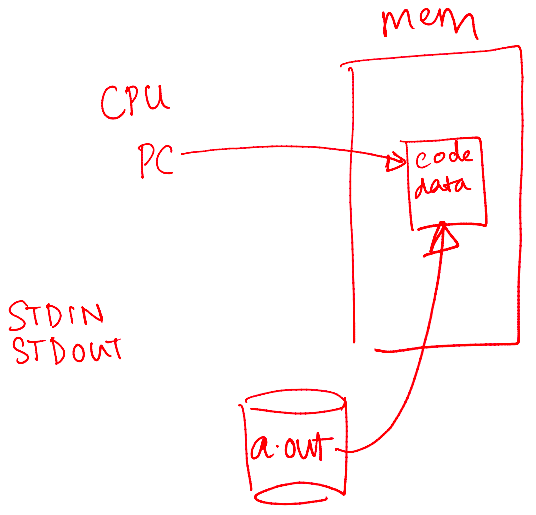

# process abstraction

## Process Abstraction

OS provides process abstraction

- When you run a executable file, the OS creates a process - a running program
- OS timeshares CPU across multiple processes, OS virtualizes CPU
- OS has a CPU scheduler that picks one of the many active processes to execute on a CPU
- A CPU scheduler contains
  - Policy: defines which process to run
  - Mechanism: defines how to "context switch" between processes

What constitutes a process?

- A unique identifier (PID)
- Memory image
  - Code and data (static)
  - Stack and heap (dynamic)
    - Stack: function calls, local vars, etc.
    - Heap: dynamically allocated memory
- CPU context: registers
  - Program counter
  - Current operands
  - Stack pointer
- File descriptors
  - Pointers to open files and devices

How does OS create a process?

- Allocates memory and creates memory image
  - Loads code and data from disk exe
  - Creates runtime stack and heap
- Opens basic files - STDIN, STDOUT, STDERR
- Initializes CPU registers
  - PC points to first instruction

States of a process

- Running: currently executing on CPU
- Ready: waiting to be scheduled
- Blocked: suspended, not ready to run
  - Why? Waiting for some event, e.g., process issues a read from disk
  - When is it unblocked? Disk issues an interrupt when data is ready
- New: being created, yet to run
- Dead: terminated 
