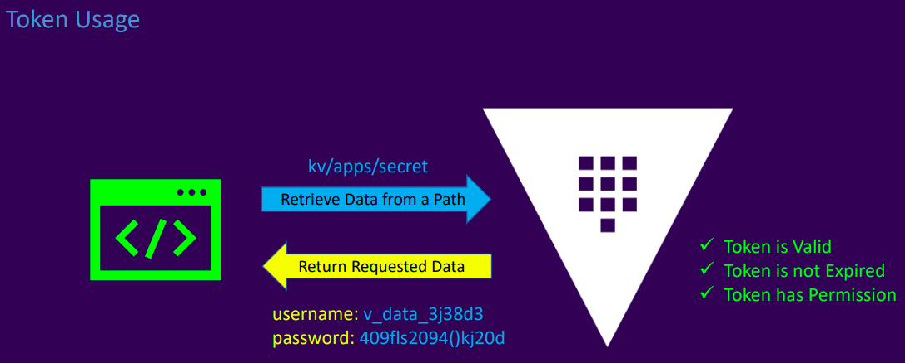
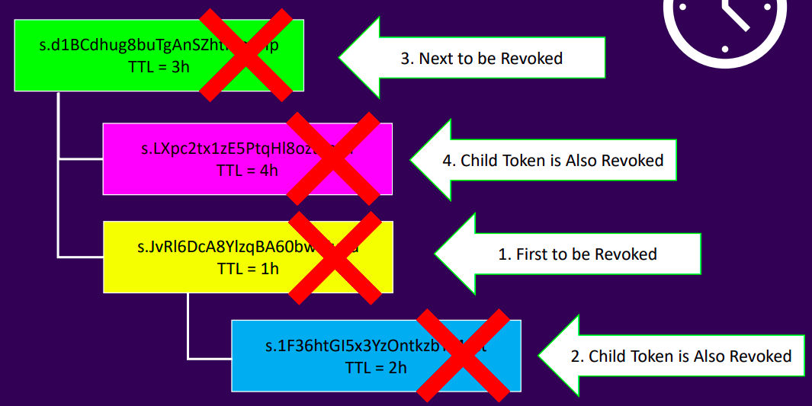
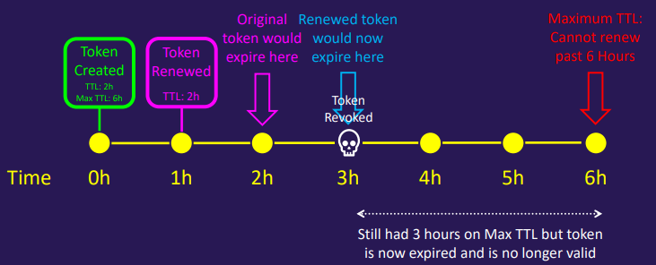

# assess vault token

The token is retained in its original form for display but is invalid

## Token Update for Vault 1.10

Vault 1.10 introduced significant token changes

- Token prefixes updated
  - Service tokens: hvs.xxx (previously s.xxx)
  - Batch tokens: hvb.xxx (previously b.xxx)
  - Recovery tokens: hvr.xxx (previously r.xxx)
- Service tokens now require a minimum length of 95 bytes

## Intro to Vault Tokens

Vault interfaces

- Token generation


- Token usage



Key features

- Tokens are the primary authentication method in Vault
  - Most operations require a token, except for login paths
- The token auth method, which cannot be disabled, manages token creation and storage
- Tokens can be used directly or with other auth methods (e.g., LDAP) to dynamically generate tokens
- Policies attached to tokens define their permissions

Token types

- Service tokens (Default)
  - Persisted to storage, involving heavy read/write operations
  - Features: renewable, revocable, and capable of creating child tokens
  - Commonly used in Vault operations
  - Example: hvs.xxx
- Batch tokens
  - Lightweight, encrypted blobs not persisted to storage
  - Ideal for high-volume tasks (e.g., encryption, DR replication)
  - Limited features compared to service tokens
  - Example: hvb.xxx

Comparing token types

| Characteristic                                      | Service Tokens                              | Batch Tokens                              |
|-----------------------------------------------------|---------------------------------------------|-------------------------------------------|
| Can be root tokens                                  | Yes                                         | No                                        |
| Can create child tokens                             | Yes                                         | No                                        |
| Renewable                                           | Yes                                         | No                                        |
| Can be periodic                                     | Yes                                         | No                                        |
| Can have explicit Max TTL                           | Yes                                         | No                                        |
| Has an accessor                                     | Yes                                         | No                                        |
| Has Cubbyhole                                       | Yes                                         | No                                        |
| Revoked with parent (if not orphan)                 | Yes                                         | Stops working                             |
| Dynamic secrets lease assignment                    | Self                                        | Parent (if not orphan)                    |
| Can be used across performance replication clusters | No                                          | Yes                                       |
| Creation scales with performance standby node count | No                                          | Yes                                       |
| Performance cost                                    | Heavyweight (Multiple writes per token creation) | Lightweight (No storage cost for token creation) |

Tokens include metadata such as

- Accessor
- Policies
- TTL / Max TTL
- Number of uses left
- Orphan token
- Renewal status

Example token lookup

```bash
vault token lookup hvs.d1BCdhug8buTgAnSZhtPm8Hp
---
Key                 Value
---                 -----
accessor            5mXJQjjQvG44ymJZ0lSHihTG
creation_time       1630436317
creation_ttl        768h
display_name        token
entity_id           n/a
expire_time         2021-10-02T14:58:37.2194177-04:00
explicit_max_ttl    0s
id                  hvs.d1BCdhug8buTgAnSZhtPm8Hp
issue_time          2021-08-31T14:58:37.2194177-04:00
meta                <nil>
num_uses            0
orphan              false
path                auth/token/create
policies            [default user]
renewable           true
ttl                 767h59m47s
type                service
```

## Token Hierarchy

Key features

- Each token has a time-to-live (TTL), except root tokens, which have no TTL
- Tokens are revoked upon reaching their TTL unless renewed
  - Tokens reaching their maximum TTL are revoked
  - Tokens can be manually revoked early
  - Revoking a parent token revokes all its child tokens



## Controlling the Token Lifecycle

Behaviors

- App Developer: "My long-running app can't regenerate tokens or secrets"
  - Solution: use a periodic service token
- Principal Engineer: "I need a token that auto-revokes after one use"
  - Solution: use a service token with a use limit
- DevOps: "My app can't use a token influenced by its parent's expiration"
  - Solution: use an orphan token

Summary

| Challenge                                            | Solution                                      |
|------------------------------------------------------|-----------------------------------------------|
| Long-running app unable to regenerate tokens/secrets | Periodic Service Token                        |
| Token must revoke after one use                      | Service Token with Use Limit                  |
| Token expiration must not depend on parent           | Orphan Service Token                          |

## Periodic Tokens

Key features

- Ideal when token revocation is problematic
  - Root or sudo users can generate periodic tokens
  - Periodic tokens have a TTL but no maximum TTL
  - They can persist indefinitely if renewed within their TTL
- Useful for long-running services unable to regenerate tokens

:::note
This is particularly effective for applications requiring continuous operation without token regeneration
:::

Policy example

```bash
path "auth/token/create" {
  capabilities = ["create", "read", "update", "delete", "sudo"]
}
```

Token creation (No max TTL)

- period &rarr; token_duration

```bash
vault token create -policy=training -period=24h
---
Key             Value
---             -----
token           hvs.2kjqZ12ofDr3efPdtMJ1z5dZ
token_accessor  73rjN1kmnzwT71pMw9H7p6P9
token_duration  24h
token_renewable true
token_policies  ["default", "training"]
identity_policies []
policies        ["default", "training"]
```

Token lookup

```bash
vault token lookup hvs.2kjqZ12ofDr3efPdtMJ1z5dZ
---
Key             Value
---             -----
accessor        73rjN1kmnzwT71pMw9H7p6P9
creation_time   1632751059
creation_ttl    24h
display_name    token
entity_id       n/a
expire_time     2021-09-28T09:57:39.7239753-04:00
explicit_max_ttl 0s # Does not have max TTL
id              hvs.2kjqZ12ofDr3efPdtMJ1z5dZ
issue_time      2021-09-27T09:57:39.7239753-04:00
meta            <nil>
num_uses        0
orphan          false
path            auth/token/create
period          24h
policies        ["default", "training"]
renewable       true
ttl             23h59m28s
type            service
```

## Service Tokens With Use Limits

Key features

- Limits the number of requests a token can make to Vault
  - Use limits complement TTL and Max TTL
  - Tokens expire after their last use, regardless of remaining TTL
  - Tokens expire at TTL's end, regardless of remaining uses


Example

```bash
vault token create -policy="training" -use-limit=2
---
Key   Value
---   -----
token hvs.516LO9Ssk1CQzvKo8ny1G0eu

vault token lookup hvs.516LO9Ssk1CQzvKo8ny1G0eu
---
Key        Value
---        -----
id         hvs.516LO9Ssk1CQzvKo8ny1G0eu
issue_time 2021-12-25T18:35:08.004652-08:00
meta       <nil>
num_uses   2
```

## Orphan Tokens

Key features

- Ideal when default token hierarchy behavior is undesirable
  - Root or sudo users can create orphan tokens
  - Orphan tokens are not children of their parent
  - Orphan tokens are independent of their parent and don't expire with it
  - They expire only when their own Max TTL is reached

Policy example

```bash
path "auth/token/create-orphan" {
  capabilities = ["create", "read", "update", "delete", "sudo"]
}
```

Example

```bash
---
vault token create -policy="training" -orphan
---
Key   Value
---   -----
token hvs.3rPJCQbGWD9O6uybtTuojjFs

vault token lookup hvs.3rPJCQbGWD9O6uybtTuojjFs
---
Key        Value
---        -----
id         hvs.3rPJCQbGWD9O6uybtTuojjFs
issue_time 2018-12-13T18:35:41.02532-08:00
meta       <nil>
num_uses   0
orphan     true  
```

## Setting the Token Type

Periodic token example

```bash
vault token create -policy="training" -period="24h"
---
Key               Value
---               -----
token             hvs.2kjqZ12ofDr3efPdtMJ1z5dZ
token_accessor    73rjN1kmnzwT71pMw9H7p6P9
token_duration    24h
token_renewable   true
token_policies    ["default", "training"]
identity_policies []
policies          ["default", "training"]
```

Batch token configuration (AppRole)

```bash
vault auth enable approle

vault write auth/approle/role/training policies="training" \
  token_type="batch" \
  token_ttl="60s"
```

Periodic token configuration (AppRole)

```bash
vault write auth/approle/role/jenkins policies="jenkins" \
  period="72h"
```

## Managing Tokens Using CLI

Use the vault token command

- capabilities
- create
- lookup
- renew
- revoke

Use command

- Syntax: `vault <object_type> <subcommand> <policy> <validity_length>`

Examples

- Create a token

```bash
vault token create -ttl=5m -policy=training
---
Key               Value
---               -----
token             hvs.12VNpg4OA9tTdCd4V6ODuDRK
token_accessor    lMIaZ4Tn1t57wKXdsfNv7vlm
token_duration    5m
token_renewable   true
token_policies    ["default", "training"]
identity_policies []
policies          ["default", "training"]
```

- Create a token with multiple policies

```bash
vault token create \
  -display_name=jenkins \
  -policy=training,certs \
  -ttl=24h \
  -explicit-max-ttl=72h
```

- Lookup token information

```bash
vault token lookup hvs.12VNpg4OA9tTdCd4V6ODuDRK
---
Key                Value
---                -----
accessor           lMIaZ4Tn1t57wKXdsfNv7vlm
creation_time      1630613718
creation_ttl       5m
display_name       token
entity_id          n/a
expire_time        2021-09-02T16:23:02.6427677-04:00
explicit_max_ttl   0s
id                 hvs.12VNpg4OA9tTdCd4V6ODuDRK
issue_time         2021-09-02T16:15:18.5177235-04:00
last_renewal       2021-09-02T16:18:02.6427677-04:00
last_renewal_time  1630613882
meta               <nil>
num_uses           0
orphan             false
path               auth/token/create
policies           ["default", "training"]
renewable          true
ttl                3m12s
type               service
```

- Revoke a token

```bash
vault token revoke hvs.12VNpg4OA9tTdCd4V6ODuDRK
---
Success! Revoked token (if it existed)
```

- Check token capabilities

```bash
vault token capabilities hvs.dhtIk8VsE3Mj61PuGP3ZfFrg kv/data/apps/webapp
---
create, list, read, sudo, update
```

- Renew a token

```bash
vault token renew hvs.dhtIk8VsE3Mj61PuGP3ZfFrg
---
Key               Value
---               -----
token             hvs.dhtIk8VsE3Mj61PuGP3ZfFrg
token_accessor    INk5tw0tl3N2xs0XZZfPc9Tq
token_duration    5m
token_renewable   true
token_policies    ["default", "training"]
identity_policies []
policies          ["default", "training"]
```

## Managing Tokens Using UI

Directions: Homepage &rarr; Profile &rarr; Copy token

## Managing Tokens Using API

Key features

- Authentication via an auth method returns a JSON response containing a token
- Parse the response (e.g., using jq) to extract .auth.client_token
- Include the token in future Vault requests via
  - X-Vault-Token header, or
  - Authorization: Bearer header

Authenticate and parse Token

```bash
curl --request POST --data @payload.json http://127.0.0.1:8200/v1/auth/userpass/login/kyphan | jq
---
{
  "request_id": "0b4181fe-0dec-2261-5231-bb3f033387e5",
  "auth": {
    "client_token": "hvs.WNS4zL4c4wQJet9KS9KItkHW",
    "accessor": "zsap13bBoQGzB5xVPZFEu3Th",
    "policies": ["default", "training"],
    "token_policies": ["default", "training"],
    "metadata": {"username": "kyphan"},
    "lease_duration": 2764800,
    "renewable": true,
    "entity_id": "88669d54-b405-c27a-d468-410a1185eb0d",
    "token_type": "service",
    "orphan": true
  }
}
```

Store token in a file

```bash
curl --request POST --data @payload.json http://127.0.0.1:8200/v1/auth/userpass/login/kyphan | jq -r ".auth.client_token" > token.txt

cat token.txt
---
hvs.dhtIk8VsE3Mj61PuGP3ZfFrg
```

Store token in an environment variable

```bash
OUTPUT=$(curl --request POST --data @payload.json http://127.0.0.1:8200/v1/auth/userpass/login/kyphan)

VAULT_TOKEN=$(echo "$OUTPUT" | jq -r '.auth.client_token')

echo "$VAULT_TOKEN"
---
hvs.dhtIk8VsE3Mj61PuGP3ZfFrg
```

Use token in requests

- Store a secret

```bash
curl --header "X-Vault-Token: hvs.dhtIk8VsE3Mj61PuGP3ZfFrg" \
  --request POST \
  --data '{ "apikey": "3230sc$832d" }' \
  https://vault.example.com:8200/v1/secret/apikey/splunk
```

- Retrieve a secret

```bash
curl --header "X-Vault-Token: hvs.dhtIk8VsE3Mj61PuGP3ZfFrg" \
  --request GET \
  https://vault.example.com:8200/v1/secret/data/apikey/splunk
```

## Root Tokens

Key features

- Root tokens are superusers with unlimited Vault access
- They have no TTL (do not expire) and are tied to the root policy
- Root tokens can create other root tokens with a TTL
- Usage: avoid daily use, revoke after necessary tasks

Initial root token

- Generated during Vault initialization
- Used for initial setup (e.g., auth methods, audit devices)
- Revoke after configuring and testing new auth methods

```bash
vault token revoke hvs.dhtIk8VsE3Mj61PuGP3ZfFrg
---
Success! Revoked token (if it existed)
```

Create root token from existing root token

```bash
vault login hvs.lmmOCfNH1HZvvBwxnLErWrhK # Root token
---
Key             Value
---             -----
token           hvs.lmmOCfNH1HZvvBwxnLErWrhK
token_accessor  5UNwzGSr1TOGymhERwZeAMgr
token_duration  ∞
token_renewable false
token_policies  ["root"]
policies        ["root"]

vault token create
---
Key             Value
---             -----
token           hvs.tiRn8HflpBJNssFaSWTTCOI2 # New root token
token_accessor  anZIDsIUzPUcs6hKKsOdwOXj
token_duration  ∞
token_renewable false
token_policies  ["root"]
policies        ["root"]
```

Generate root token with unseal/recovery keys

- Useful in emergencies or for specific tasks
- Requires a quorum of unseal key holders to prevent single-person control

Steps

- Initialize root generation

```bash
vault operator generate-root -init
---
Nonce         5b6e3831-2a45-4695-7757-5810074d36c8
Started       true
Progress      0/1
Complete      false
OTP           E87jF6ZeJo8NjJwvytl7mvKLEr
OTP Length    26
```

- Key holders provide unseal keys

```bash
vault operator generate-root
Unseal Key (will be hidden):
---
Nonce         f8579a51-5138-c319-445d-2d3640119f87
Started       true
Progress      1/3
Complete      false
```

- Complete generation

```bash
vault operator generate-root
Unseal Key (will be hidden):
---
Nonce         f8579a51-5138-c319-445d-2d3640119f87
Started       true
Progress      3/3
Complete      true
Encoded Token G2NeKUZgXTsYYxILAC9ZFBguPw9ZXBovFAs
```

- Decode root token

```bash
vault operator generate-root \
  -otp="hM9q24nNiZfnYIiNvhnGo4UFc3" \
  -decode="G2NeKUZgXTsYYxILAC9ZFBguPw9ZXBovFAs"
---
Root token: hvs.gXtT3uq9teYf0ZnFQH6hOiw8
```

## Token Accessors

Key features

- Every token has an associated accessor, a reference used for limited actions
  - Look up token properties
  - Look up token capabilities
  - Renew the token
  - Revoke the token

:::note
Accessors cannot authenticate to Vault or perform additional requests
:::

Examples

- Root token accessor

```bash
vault login hvs.cbC7GJ6U6WJaDuDSgkyVcKDv
---
Key             Value
---             -----
token           hvs.cbC7GJ6U6WJaDuDSgkyVcKDv
token_accessor  K6pHtVc9LbXQdUavg2J1Ixa2
token_duration  ∞
token_renewable false
token_policies  ["root"]
policies        ["root"]
```

- Regular token accessor

```bash
vault token create -policy=training -ttl=30m
---
Key             Value
---             -----
token           hvs.5YmCHHV80mN3dJpzOwvVAYk8
token_accessor  2ogWa36gDH5wsO8VbuxroByx
token_duration  30m
token_renewable true
token_policies  ["default", "training"]
policies        ["default", "training"]
```

Actions with accessors

- View token properties

```bash
vault token lookup -accessor gFq2UwnJ0jo87kESKwUcl1Ub
---
Key             Value
---             -----
accessor        gFq2UwnJ0jo87kESKwUcl1Ub
creation_time   1632576647
creation_ttl    30m
display_name    token
entity_id       n/a
expire_time     2021-09-25T10:00:47.0615482-04:00
explicit_max_ttl 0s
id              n/a
issue_time      2021-09-25T09:30:47.0615482-04:00
meta            <nil>
num_uses        0
orphan          false
path            auth/token/create
policies        ["default", "training"]
renewable       true
ttl             29m18s
type            service
```

- Revoke a token

```bash
vault token create -policy=training -ttl=30m
---
Key             Value
---             -----
token           hvs.5YmCHHV80mN3dJpzOwvVAYk8
token_accessor  2ogWa36gDH5wsO8VbuxroByx
token_duration  30m
token_renewable true
token_policies  ["default", "training"]
policies        ["default", "training"]

vault token revoke -accessor 2ogWa36gDH5wsO8VbuxroByx
---
Success! Revoked token (if it existed)
```

- Renew a token

```bash
vault token renew -accessor gFq2UwnJ0jo87kESKwUcl1Ub
---
Key             Value
---             -----
token           n/a
token_accessor  gFq2UwnJ0jo87kESKwUcl1Ub
token_duration  30m
token_renewable true
token_policies  ["default", "training"]
policies        ["default", "training"]
```

Limitation of accessors

- Cannot use an accessor to perform traditional Vault actions

```bash
vault token create -policy=training -ttl=30m
---
Key             Value
---             -----
token           hvs.vZRfetFFawRIVKJu8Uc50M9o
token_accessor  gFq2UwnJ0jo87kESKwUcl1Ub
token_duration  30m
token_renewable true
token_policies  ["default", "training"]
policies        ["default", "training"]

export VAULT_TOKEN=gFq2UwnJ0jo87kESKwUcl1Ub

vault kv get secret/apps/training
---
Error making API request
URL: GET http://127.0.0.1:8200/v1/sys/internal/ui/mounts/secret/apps/training
Code: 403. Errors:
* permission denied
```

## Explaining Time-to-Live (TTL)

Key features

- Every non-root token has a TTL, defining its validity period from creation or renewal
  - Example: a new token with a 30-minute TTL is valid for 30 minutes from creation
  - Example: a renewed token gets a fresh 30-minute TTL
- When TTL expires, the token is revoked and becomes invalid for authentication. Renewal must occur before expiration
  - Tokens may also have a Max TTL, limiting renewals; once reached, the token cannot be renewed further

A token can have a TTL and a Max TTL

- The token can be renewed up until the Max TTL
- Once the token hits the Max TTL, it cannot be renewed further


Example



Default TTL

- Vault's default TTL is 768 hours (32 days), adjustable via the configuration file

```bash
default_lease_ttl = 24h
```

Setting TTL

- Explicitly set TTL during creation

```bash
vault token create -policy=training -ttl=60m
```

- Configure auth method for specific TTL

```bash
vault write auth/approle/role/training-role \
  token_ttl=1h \
  token_max_ttl=24h
```

- Default TTL applied if unspecified, Vault applies the default TTL

```bash
vault token create -policy=training
```

## Create a Token Based on Use Cases

Long-running application

- Needs: app cannot regenerate tokens/secrets; token renewable indefinitely
- Solution: periodic token

Limited use

- Needs: token usable only 3 times, regardless of TTL
- Solution: service token with use limits

Independent lifecycle

- Needs: token unaffected by parent's lifecycle, with extended expiration
- Solution: orphan token

CIDR

- Needs: token used by a specific host or within a certain network block
- Solution: CIDR-bound token

Replication and efficiency

- Needs: token replicated across clusters, minimal storage overhead for mass creation
- Solution: batch token

## Lab

### Vault Tokens
