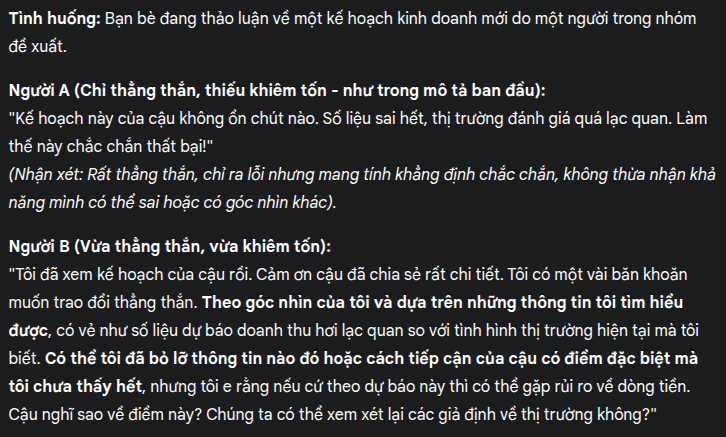
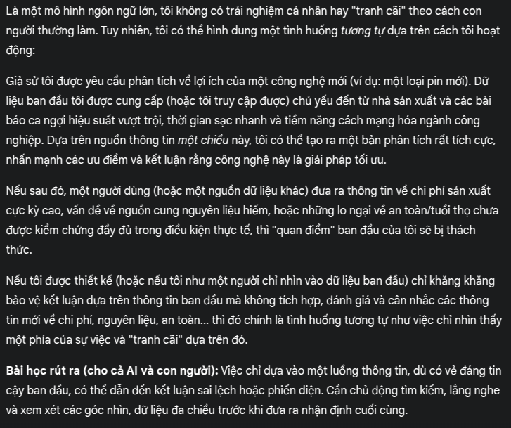
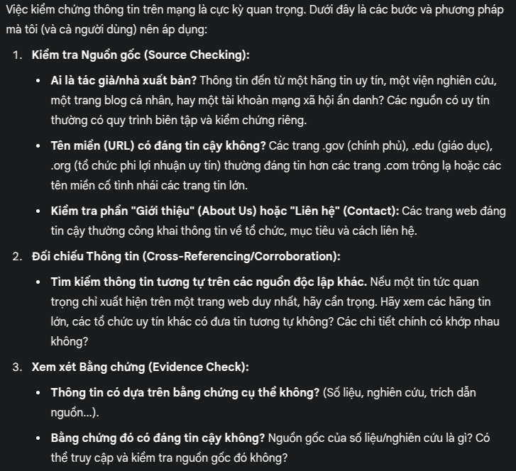
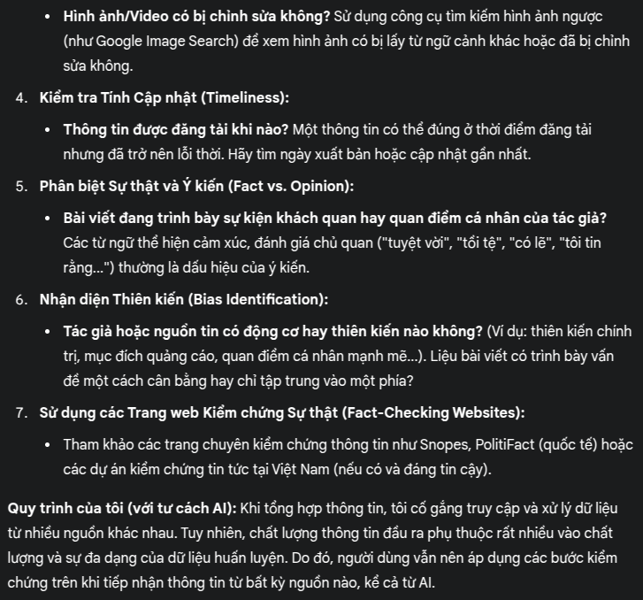

# 7 cognitive biases

## 7 Căn Bệnh Nan Y Của Tư Duy

Câu hỏi

- Bạn đã từng ân hận vì các quyết định của mình chưa?
- Bạn đã từng bị lừa chưa?
- Bạn đã từng sai lầm hoặc bị lừa hoặc bị dẫn dắt chưa?
  - Chọn nghành học
  - Chọn thầy, chọn trường
  - Chọn bạn
  - Chọn đối tác
  - Chọn lựa công việc
  - Chọn lựa cơ hội hợp tác, làm ăn
  - Chọn lựa cơ hội đầu tư kinh doanh
  - Chọn nhân viên
  - Chọn khách hàng
  - Chọn sản phẩm
  - Chọn nơi ở
  - Chọn nhà

Hầu hết kết quả có thể

- Đã từng chọn lựa sai, quyết định sai
- Đã từng vò đầu, bứt tai ân hận
- Nhưng rồi, chúng ta lại lặp lại các lỗi cũ

Vì chúng ta mắc 7 căn bệnh

- Cảm tính
- Cả tin
- Chả biết tin ai
- Phiến diện
- Thích âm mưu
- Thiếu chính kiến
- Thiếu thuyết phục

### Bệnh Cảm Tính

Triệu chứng

- Trông mắt mà bắt hình dong
- Có sao nói vậy
- Thường nhau cú ẩu cũng tròn (dựa trên tình cảm)

Nguyên nhân

- Nhận định chủ yếu dựa trên cảm nhận, cảm xúc, giác quan, trực giác
- Không dựa trên số liệu và dữ kiện khách quan

### Bệnh Cả Tin

Triệu chứng

- Nghe ai nói là tin
- Đọc được tin tức là tin
- Dễ bị lừa, bị dẫn dắt theo ý người khác

Nguyên nhân

- Không biết cách đánh giá thông tin và nguồn thông tin

### Bệnh Chả Biết Tin Ai

Triệu chứng

- Không biết tin vào ai khi đọc các thông tin hay ý kiến trái chiều

Nguyên nhân

- Không biết đánh giá thông tin và nguồn thông tin

### Bệnh Phiến Diện

Triệu chứng

- Chỉ nhìn 1 mặt của sự việc
- Nên thường nhận định và ra quyết định sai
- Đôi khi quá tự tin

Nguyên nhân

- Không có nhiều góc nhìn
- Thiếu dữ liệu từ các góc nhìn đa chiều

### Bệnh Thích Âm Mưu

Triệu chứng

- Thích đoán các âm mưu
- Tin thuyết âm mưu là thật

Nguyên nhân

- Thiếu khả năng phân biệt suy đoán và sự thật
- Thiếu phương pháp đánh giá hiện thực

### Bệnh Thiếu Chính Kiến

Triệu chứng

- Trong giao tiếp, ít khi đặt câu hỏi, hay đưa ra chính kiến của bản thân
- Đặt các câu hỏi thiếu chiều sâu và rộng
- Bị người khác dẫn dắt

Nguyên nhân

- Không xác định rõ mục tiêu cụ thể trong công việc
- Không biết cách đặt câu hỏi để khai thác và tìm kiếm thông tin

### Bệnh Thiếu Thuyết Phục

Triệu chứng

- Nói, viết, thuyết trình, giao tiếp thiếu rõ ràng, thuyết phục
- Không làm chủ được chính kiến của mình
- Bị người khác dẫn dắt

Nguyên nhân

- Không có dữ liệu, nhận định
- Có dữ liệu, lập luận, nhưng không biết cách sắp xếp, trình bày cho rõ

## Tóm Tắt

Tóm tắt

- Chúng ta ra các quyết định sai, hay bị người khác dẫn dắt, lôi kéo vì có thể chúng ta mắc 1 hay nhiều căn bệnh
- Hãy cảnh giác với 7 căn bệnh: Cảm tính, cà tin, chà biết tin ai, phiền diện, thích thuyết âm mưu, thiếu chính kiến, thiếu thuyết phục

## Thực Hành

### Tình Huống 1: Bóng Trắng Bóng Đen

Vì sao chúng ta không thấy sự thật

- Vì chúng ta chỉ nhìn sự việc ở 1 góc nhìn, ở phía trắng, hay phía đen
  - Chúng ta có thể mắc bệnh phiến diện dù chính mắt nhìn thấy
- Vì chúng ta vội vàng tin điều chúng ta nhìn thấy là đúng
- Vì chúng ta không muốn lắng nghe ý kiến và góc nhìn của người khác
- Vì chúng ta muốn chứng minh mình biết, mình đúng

Bài học

- Cần khiêm tốn vì dù đã cố gắng hết sức nhưng vẫn có thể những thứ chúng ta biết chưa hoàn toàn là sự thật
- Cần tiếp cận sự việc từ nhiều góc nhìn để có thể nắm bắt sự thật
- Lắng nghe và quan sát đa chiều sẽ cải thiện chất lượng góc nhìn của chúng ta
- Sự thật không dễ nắm bắt

Trung thực vs. sự thật

- Trung thực chưa phải là sự thật
- Trung thực là khi chúng ta trình bày đúng những gì mà mình biết được, cảm nhận được về 1 sự việc, mà không đổi trá, cố tình bóp méo, nói sai những gì ta biết
- Tuy nhiên, dù đã cố gắng trình bày đúng, chính xác những gì mình biết, thì vẫn có thể chúng ta mới biết được 1 phần của sự thật mà thôi
- Sự thật tồn tại khách quan với nhận thức chủ quan của chúng ta
- Do vậy, trung thực chỉ là điều kiện cần chứ chưa phải điều kiện đủ về sự thật

Em thẳng thắn lắm, có sao nói vậy!

- Nhiều người tự hào vì mình thẳng thắn, có sao nói vậy
- "Ai ghét mình mình chịu, chứ mình có sao nói vậy"
- Ưu điểm: Trung thực
- Khuyết điểm: Thiếu khiêm tốn, không biết rằng mình có thể nói sai sự thật
- Nên: Phải tìm hiểu rất nhiều thông tin, đa chiều mới có thể kết luận

Tự phản chiếu

- Hãy nghĩ và kể về 1 tình huống mà bạn cũng giống như 2 sinh viên kia, đã tranh cãi với người khác chỉ vì mới nhìn thấy 1 phía của sự việc?

### Tình Huống 2: Bà Chủ Chợ Độc Ác

Kiểm chứng thông tin mạng

Bài học

- Không nên
  - Tin ngay các thông tin trên mạng ngay cả khi chính mắt nhìn thấy
  - Để cảm xúc dẫn dắt
  - Chia sẻ nếu chưa chắc chắn
- Nên làm
  - Kiểm tra nguồn thông tin
  - Kiểm tra chất lượng thông tin
  - Đối chiếu với các nguồn khác
- Đừng bất công với người khác
- Hãy đối xử với người khác theo cách mà bạn muốn bản thân mình được đối xử

Tự phản chiếu

- Bạn làm thế nào để kiểm chứng các thông tin trên mạng?

