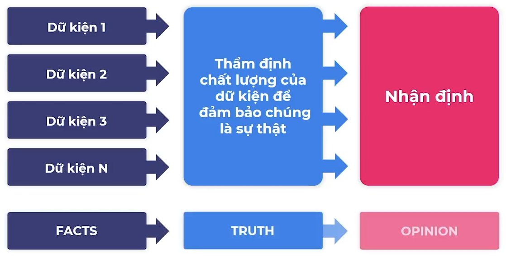
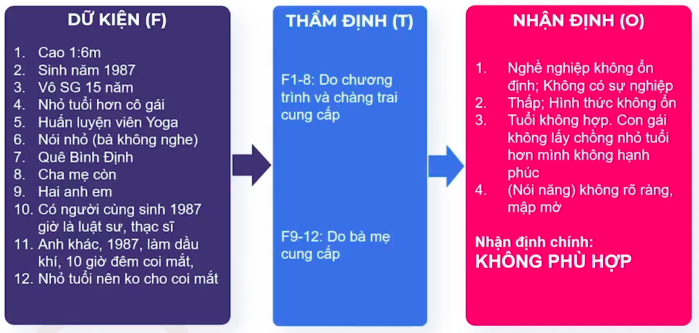
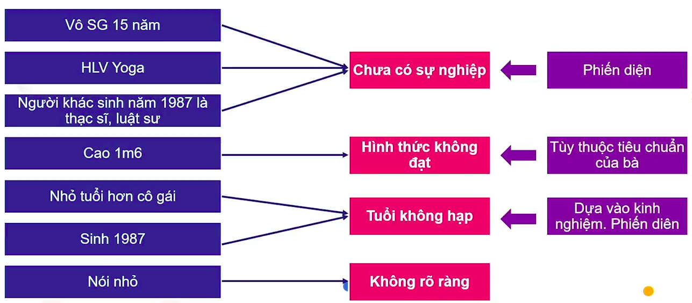

# prescriptions

## Thuốc Đặc Trị

Quyết định sai vì?

- Dữ liệu sai (F) &rarr; Nhận định sai (O) &rarr; Quyết định sai (T)

Ví dụ: Quyết định chọn đối tác kinh doanh

- Vì nghe nói đối tác rất giàu &rarr; Đối tác tốt &rarr; Hợp tác
- Dữ liệu ít, yếu, không quan trọng &rarr; Nhận định ẩu &rarr; Quyết định sai
- Dữ liệu (F)
  - Khả năng tài chính
  - Cam kết, đạo đức
  - Kinh nghiệm kinh doanh
  - Tiềm năng của thị trường
- Kiểm chứng dữ liệu
  - Các dữ liệu này bạn lấy từ đâu?
  - Từ nghe đối tác nói?
  - Hay nghe ai đó nói?
  - Hay tìm trên mạng?
  - Chúng có đủ tin cậy?
- Thẩm định dữ liệu (T)
  - Thảo luận với các đối tác
  - Từ các báo cáo
  - Từ đến thăm các cơ sở kinh doanh
  - Từ kế hoạch kinh doanh
  - Từ trao đổi với những người biết về đối tác
  - Từ các nguồn khác
- Nhận định (O)
  - Đối tác tốt
- Thu thập đầy đủ dữ liệu &rarr; Thẩm định chặt chẽ &rarr; Nhận định đúng

## Thuốc Đặc Trị FTO

Dữ liệu

- Đầy đủ
- Từ nhiều góc nhìn
- Được tổ chức logic
- Liên quan và có ý nghĩa

Thẩm định dữ liệu

- Thẩm định khách quan, đúng đắn, chính xác

Nhận định

- Nhận định dựa trên sự thật

10 tiêu chuẩn để đánh giá

- Ý nghĩa
- Liên quan
- Đúng đắn
- Chính xác
- Rõ ràng
- Rộng
- Sâu
- Logic
- Toàn diện
- Công bằng

## Các Trạng Thái Bệnh Lý Theo FTO

Thu thập dữ kiện, dữ liệu (F)

- Thiếu, không có dữ liệu
- Góc nhìn hạn chế
- Không biết tìm kiếm, khai thác, sàng lọc
- Không biết phân tích, tổng hợp
- Thiếu công nghệ

&rarr; Bệnh liên quan

- Cảm tính
- Cả tin
- Phiến diện
- Thích âm mưu
- Thiếu thuyết phục

Thẩm định dữ liệu (T)

- Không có hoài nghi khoa học
- Không có phương pháp thẩm định dữ liệu
- Thiếu thận trọng và chuyên nghiệp
- Thiếu nguồn để đối sánh
- Không nhận ra các điểm thiếu logic giữa các nguồn hay giữa các dữ liệu

&rarr; Bệnh liên quan

- Cả tin
- Chả biết tin ai
- Phiến diện
- Thích âm mưu
- Thiếu thuyết phục

Đưa ra nhận định (O)

- Không hiểu ý nghĩa dữ liệu
- Nhận định ẩu, sai, cảm tính
- Nhận định phiến diện
- Không biết nhận định gì

&rarr; Bệnh liên quan

- Cảm tính
- Cả tin
- Chả biết tin ai
- Thiếu chính kiến
- Thiếu thuyết phục

## Quy Trình Đánh Giá 1 Nhận Định

Dữ liệu (F) &rarr; Sự thật (T) &rarr; Nhận định (O)

Quy trình

- Bước 1: Vẽ mô hình FTO
  - Diễn nhận định, dữ liệu, và sự thật
- Bước 2: Đánh giá dữ liệu
  - Có dữ liệu khách quan không? Có đầy đủ không? Có thiên lệch về góc nhìn nào không? Có cần bổ sung thêm dữ liệu nào không? Dữ liệu có cập nhật không?
- Bước 3: Kiểm chứng sự thật
  - Các dữ liệu có trích dẫn từ nguồn đáng tin cậy không? Có thể kiểm tra được không? Có phương pháp nào có thể kiểm tra các dữ liệu quan trọng không?
- Bước 4: Đánh giá nhận định
  - Các nhận định có thực sự dựa trên số liệu hay mang tính chủ quan? Các dữ kiện đi đến nhận định có kết hợp logic không? Có thể có các nhận định khác từ dữ liệu đang trình bày không?

## Điều Trị Tận Gốc 7 Căn Bệnh

| **Căn bệnh**         | **Nguyên nhân**         |
|----------------------|-------------------------|
| Cảm tính             | Không hoặc thiếu F      |
| Cà tin               | Thiếu F và T            |
| Chà biết tin ai      | Thiếu T                 |
| Phiền diện           | Thiếu F                 |
| Thích âm mưu         | Thiếu F và T            |
| Thiếu chính kiến     | Thiếu F, T, O           |
| Thiếu thuyết phục    | Không biết sắp xếp FTO  |

## Bài Học Và Tóm Tắt

Bài học

- Nhận định (O) tốt được hình thành dựa trên các dữ kiện khách quan, đa chiều, toàn diện
- Các dữ kiện (F) càng đầy đủ thì nhận định càng tốt
- Dữ kiện phải được thẩm định để đảm bảo tính đúng đắn và chính xác, hay sự thật (T)

Tóm tắt

- Liều thuốc đặc trị FTO chính là Dữ kiện – Sự thật – Nhận định
- Nhận định tốt dựa trên dữ kiện đầy đủ, toàn diện, đúng đắn, và chính xác

## Thực Hành

### Tình Huống 1: Mẹ Vợ Kén Rể

Câu hỏi

- Nhận định của bà mẹ về chàng trai đúng hay sai?
- Làm thế nào để có thể đánh giá nhận định của bà mẹ một cách tường minh

Quy trình

- Vẽ mô hình FTO

- Đánh giá
  - Các nhận định của bà mẹ đều phiến diện, cảm tính, và mang nặng yếu tố kinh nghiệp
  - Kinh nghiệm có thể tốt để tham khảo. Nhưng kinh nghiệm đúng cho trường hợp này mà sai với trường hợp khác
  - Để tránh phiến diện, bà mẹ cần
    - Tìm hiểu anh chàng về nhiều góc độ với thời gian lâu hơn
    - Nghề nghiệp, thu nhập, tài sản, tính cách, gia đình, lối sống, ...

- Ra quyết định
  - FTO giúp chúng ta phân tích tình huống
  - Nhưng để ra quyết định, trong tình huống này còn 1 thành phần cần xem xét: Mục tiêu và tiêu chuẩn chọn rồng, rể
  - Không có mục tiêu và tiêu chuẩn có khả năng có gái mãi mãi "thấp không thông, cao thì không tới"

Mục tiêu và tiêu chuẩn

- Xác định đúng mục tiêu và tiêu chuẩn cho người chồng tương lai
  - Hình thức cao 1m8 và 6 múi thì quá tốt, nhưng thực tế là không thấp hơn 1m6, dễ nhìn, khỏe mạnh
  - Là tỷ phú thì quá hay, nhưng thực tế là có nghề nghiệp, thu nhập ổn định từ 20 triệu/tháng
  - Trên hết, cầu tiến và yêu thương vợ con

### Tình Huống 2: Bạn Có Hạnh Phúc
