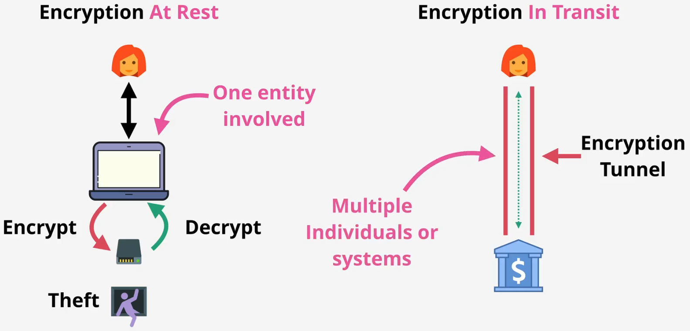
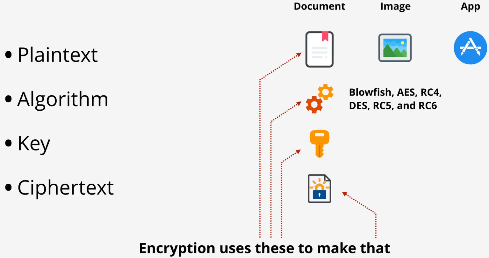
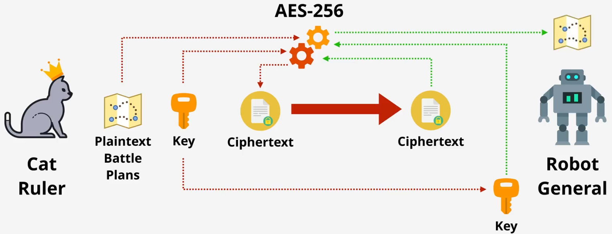
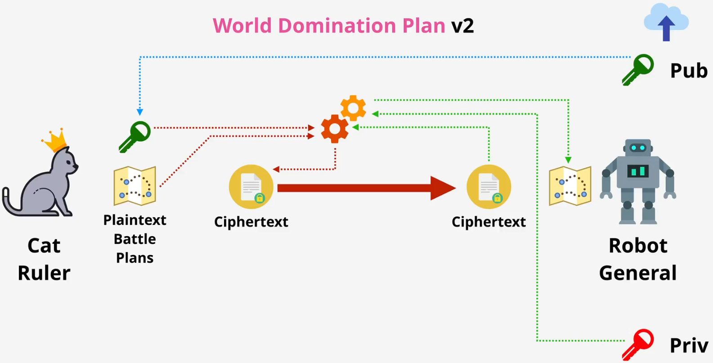
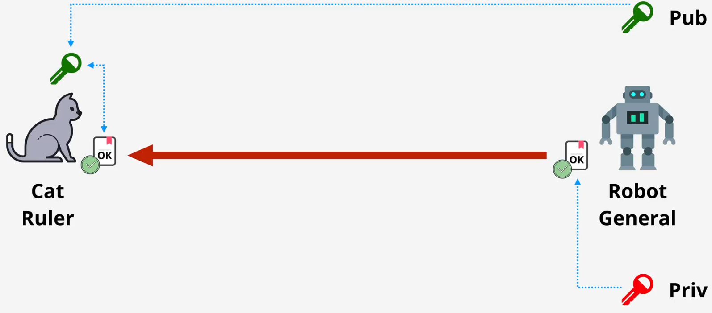

# encryption and security

## Encryption

Approaches

- Encryption at rest
  - The laptop encrypts data when writing it to internal storage and decrypts it when reading it back
  - In cloud environments, data is stored in encrypted form on shared hardware
- Encryption in transit
  - Protecting data during transfer between two places

Concept

- Encryption transforms plaintext into ciphertext using an algorithm and a key
  - Plaintext: Unencrypted data that can be loaded directly into an application
  - Algorithm: A mathematical code that takes plaintext and an encryption key to create ciphertext
  - Key: Can be as simple as a password or much more complex
  - Ciphertext: Encrypted data that is unreadable without the appropriate key to decrypt it

### Symmetric Encryption

Symmetric encryption is ideal for local file or disk encryption on laptops but less practical for data transfer between two remote parties due to the challenge of securely sharing the key

### Asymmetric Encryption

Asymmetric encryption is more computationally intensive than symmetric encryption. It is often used to securely exchange a symmetric key between two parties, who then use that symmetric key for faster communication

## Signing

Context

- When Robot General receives a battle plan from Cat Ruler, he wants to acknowledge and agree to it
- However, if Robot General sends a simple "OK" message encrypted with Cat Ruler's public key, anyone could send a similar encrypted message, pretending to be Robot General
- Encryption does not prove the sender's identity

- Robot General shares its public key with Cat Ruler over a secure channel
- Robot General uses its private key to create a digital signature for the message
- Robot General sends the message and its signature to Cat Ruler
- Cat Ruler uses Robot General's public key to verify the signature, confirming that the message was signed with Robot General's private key and ensuring its authenticity and integrity

## Steganography

Context

- Encrypted data is obviously encrypted, making it clear that a file has been secured
- Governments or authorities may demand decryption, and refusal could lead to legal consequences

Definition

- Steganography is the practice of hiding information within a carrier, such as an image

Example

- Cat Ruler hides a message in a puppy image and sends it to Robot General, who knows how to extract the data
- To an outsider, the image appears normal, providing plausible deniability
- The carrier image may increase slightly in size, but it looks nearly identical to the original
- An example involves hiding the message "HI" in a puppy image by adjusting pixel values: the decimal values for "H" (72) and "I" (73) are encoded by altering two pixels by 8 and 9, respectively
- Advanced steganography algorithms make the hidden data extremely difficult to detect without a specific key or pattern
- While this method is basic, real-world steganography algorithms are far more complex and harder to detect

## Security - Pending
