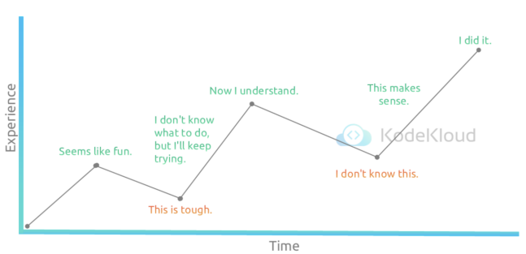
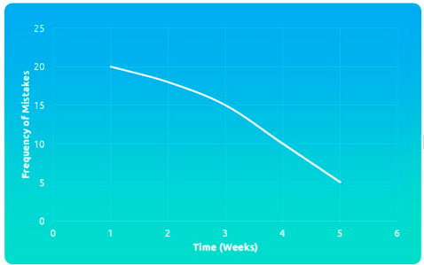

# growing learning adapting to change (done - not learn yet)

This section opens and closes with an assessment about adaptability and change

The core content covers how to create habits of growing, learning, and adapting to change

The scenario/story video will cover a situation of what to do when there is too much to know/learn

The overall focus for this section is how to maintain knowledge, skills, and concepts in an ever-changing and expanding IT landscape

## A mindset of continual learning

Why?

- Continuous learning is an option and a necessity for staying relevant and effective

Making learning a must

- Prioritizing learning is about personal growth and staying agile and responsive in a rapidly evolving field
- Integrating learning into your daily work
- Creating a learning-friendly environment
- Make learning part of the workload assessment

Preparing to be uncomfortable

- Learning requires a mindset of accepting that you will "not know", "not be good" or "not see results" at first or even for a while

Risk of stagnation

- In the rapidly evolving field, stagnation is a pause in progress and a step towards obsolescence (outdatedness)

Accepting new tools and new ideas

- Innovation
- Survival
- Success

Beyond technical skills

- If you are here, then you can already appreciate that you must grow beyond just the technology
- They could be collaboration, communication, etc.

Growing your value to the business

- When you grow, your value to the business grows especially in areas that the business needs
- Learn &rarr; business &rarr; value

**Summary**

- A mindset of continual improvement is necessary to be in the right frame of mind to grow and learn
- This section covered the various benefits of having a learning mindset
- There are many risks particularly in IT if you do not grow your skills, concepts, and new ways of working
- Growing your skills increases your value and your value to the business for which you work

## Rituals for growth and learning

Why?

- Cultivating strong learning habits is the key to staying ahead
- Start &rarr; learning &rarr; skill development &rarr; professional growth &rarr; success

Identifying learning opportunities

- Every challenge and task presents a unique opportunity for learning and growth
- Explore relevant areas of passions and interests
- Stay updated on industry trends related to business, project, and work
- Request feedback from peers inside and outside your company in your industry
- Learn from failure to enhance success

Setting learning goals

- You don’t have to learn everything, you just have to learn the relevant things!
- Set goals for direction and measurement
- Make the goals SMART
- Balance passion with realism and history
- Track the goals

Creating a learning routine

- A learning routine is a time-boxed repeatable commitment to do, learn, grow every day

Leveraging resources and tools

- Learning resources
- Digital tools
- Community and networking
- Personal learning toolkit

Applying learning in practice

- Learning is only as valuable as its application in real-world scenarios
- Learning a concept
- Practicing in a safe environment
- Applying in a real project
- Reflecting on the outcome

**Summary**

- This section is all about habits of learning and growing
- Setting learning goals that are S.M.A.R.T. and relevant to your business, organization, department, or project is essential
- Tracking those goals and balancing passion with relevancy are important
- This is a lifelong journey, more like a marathon than a sprint, so engage it with an eye on sustainability

## The truth about skill acquisition

Why?

- Learning new tech skills is tough but common because knowledge transformation is inherently challenging
- New skills: Could computing, AI, Blockchain, Scripting and Automation

Time, effort, and failure

- Learning is about the role of time, effort, and accepting failure on the way to success

Realistic expectations

Learning to love mistakes

- The fear of appearing uninformed hinders learning without acceptance, teaching opportunities are missed

Overcoming cognitive challenges

- Right mindset
- Right environment
- Meaningful goals
- Take things slow and in small chunks
- Vary the learning to keep it interesting
- Apply it when possible
- Don't quit unless you have achieved something

Persistence is key

- Setting achievable goals
- Creating supportive learning environment
- Reflecting on progress
- Establishing accountability
- Scheduling to protect time
- Enlisting a cheerleader for support

Keep it interesting!

- Videos
- Books
- Webinar
- Articles
- Tutorials

Exploring learning styles

- Abstract vs concrete
  - Expertise and concepts
  - Experience and hands on
- Switch mediums
  - Videos and books
  - Live lectures and collaboration
- Send instead of receiving
  - Teaching something to learn
  - Learning it plain

**Summary**

- The section covers the difficulty and challenges of learning something
- It focuses on persistence and long-term versus quick, short-term efforts
- Your personal needs and commitments will increase or ease your resistance so your foundations are in place
- Variety and accountability help to foster a commitment to learning and growing

## Story - what to learn when there is too much to know
