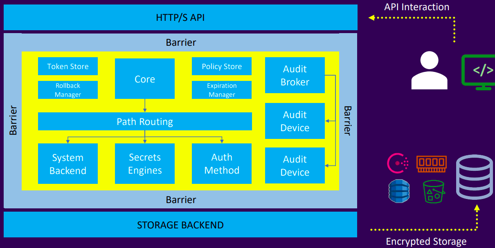
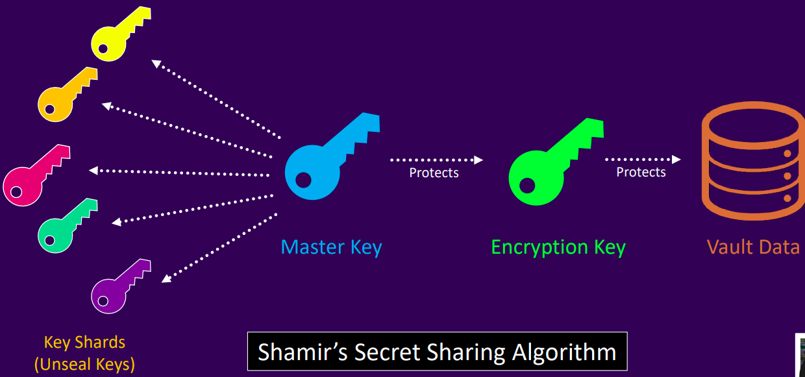
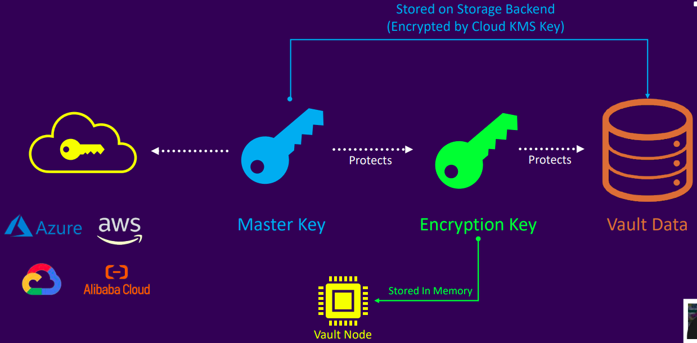
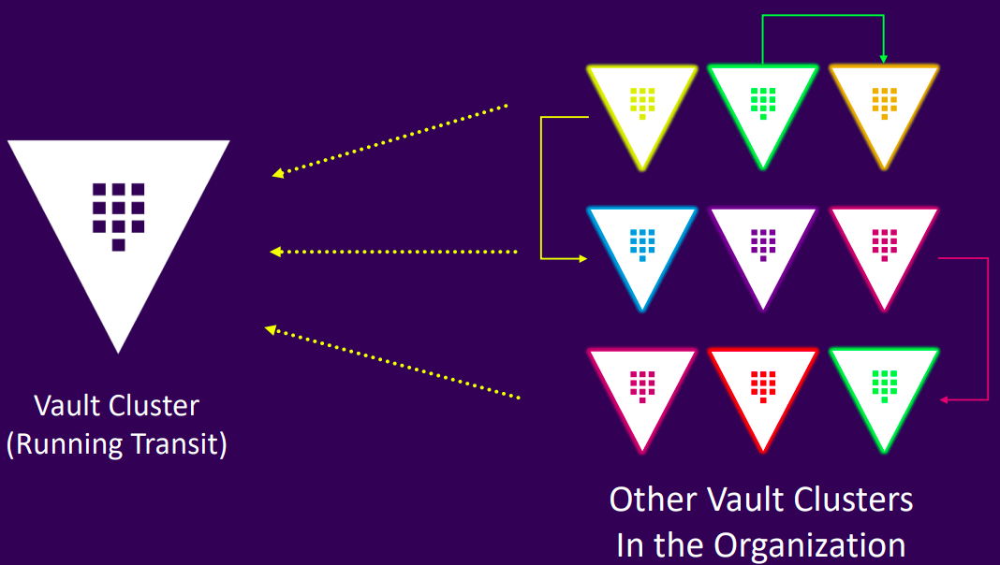
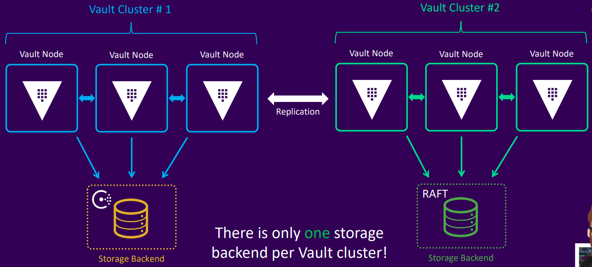
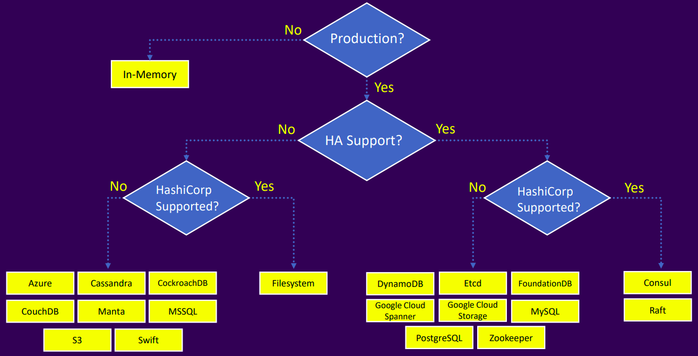
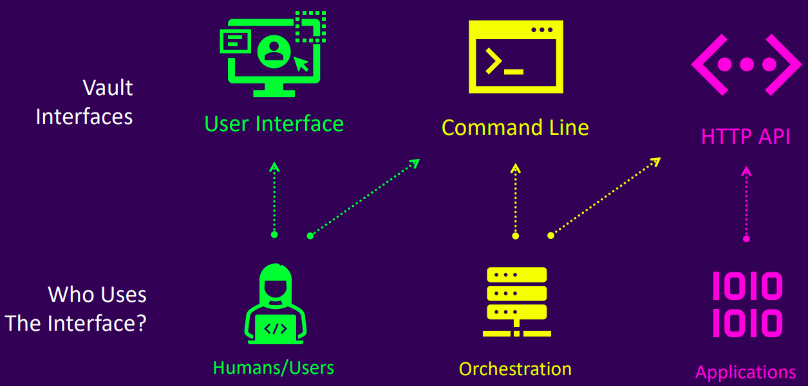

# learning the vault architecture

## Vault Components

Storage backends

- Configure the location for storing Vault data
- Storage is defined in the main Vault configuration file with desired parameters
- All data is encrypted in transit using TLS and at rest using AE256
- Not all storage backends are created equal
  - Some support high availability
  - Others offer better tools for management and data protection
- Each Vault cluster can have only one storage backend

Secrets engines

- Manage secrets for your organization
- Store, generate, or encrypt data
- Connect to other services to generate dynamic credentials on demand
- Can be enabled and used as needed, including multiple instances of the same type
- Are enabled and isolated at a specific "path"
  - All interactions occur directly with the path itself

Auth methods

- Perform authentication and manage identities
- Assign identities and policies to users
- Can be enabled depending on your use case
  - Auth methods can be categorized as human-based or system-based
- Once authenticated, Vault issues a client token for all subsequent requests (read/write)
  - The primary purpose of auth methods is to obtain a token
  - Each token has an associated policy (or policies) and a TTL
- The default authentication method for a new Vault deployment is tokens

Audit devices

- Maintain a detailed log of all requests and responses to Vault
- Audit logs are formatted in JSON
- Sensitive information is hashed before logging
- More than one audit device can (and should) be enabled
  - If an audit device is enabled, Vault requires at least one to write logs before completing a request
  - Prioritizes security over availability

## Vault Architecture and Pathing Structure

Vault architecture



- Anything that moves outside the barrier is encrypted
- Anything that passes through the barrier into the core is decrypted
- Vault inherently does not trust the storage backend, all data is encrypted before being written to storage

Vault paths

- Everything in Vault is path-based
- The path prefix tells Vault which component a request should be routed
- Secret engines, auth methods, and audit devices are "mounted" at a specified path. This is often referred to as a "mount"
- The available paths depend on which features are enabled in Vault (e.g., auth methods, secrets engines)
- The system backend is a default backend mounted at the /sys endpoint
- Vault components can be enabled at any path you choose using the path flag
  - Each component also has a default path that can be used
- Vault includes several system-reserved paths that cannot be removed or overridden

| Path Mount Point | Description |
|------------------|-------------|
| `auth/`         | Endpoint for auth method configuration |
| `cubbyhole/`    | Endpoint used by the Cubbyhole secrets engine |
| `identity/`     | Endpoint for configuring Vault identity (entities and groups) |
| `secret/`       | Default mount point for the Key/Value v2 secrets engine (in dev mode) |
| `sys/`          | System endpoint for configuring Vault |

## Vault Data Protection

How does Vault protect my data?


Master key

- Used to decrypt the encryption key, which is required to access stored data
- Created during Vault initialization or during a rekey operation
- Never written to storage when using traditional unseal mechanism
- When using Auto Unseal, the master key is written securely to the storage backend (core/master)

Encryption key

- Used to encrypt and decrypt the data written to storage backend
- Encrypted by the Master Key
- Stored alongside the encrypted data in a keyring on the storage backend
- Can be rotated manually

## Seal and Unseal

What is seal and unseal?

- Vault starts in a sealed state, meaning it knows where and how to access data, but it cannot decrypt the data
- In the sealed state, almost no operations are possible, only status checks and unsealing
- Unsealing Vault allows a node to reconstruct the master key, which is used to decrypt the encryption key, ultimately enabling access to the data
  - After unsealing, the encryption key is stored in memory
- Sealing Vault discards the encryption key from memory, requiring another unseal to resume operations
  - The encryption key is always stored in the storage backend and encrypted using the master key
- Vault always starts in a sealed state. You can also manually seal it at any time using the UI, CLI, or API

When should you manually seal Vault?

- If key shards are accidentally exposed
- Upon detection of a compromise or network intrusion
- If there is spyware or malware detected on the Vault node

Unsealing options

- Key Sharding (Shamir's Secret Sharing)
  - Requires a minimum number of key shares to reconstruct the master key manually
- Cloud auto unseal
  - Automatically retrieves and unseals Vault using a key stored in a cloud provider's key management service (e.g., AWS KMS, Azure Key Vault, GCP KMS)
- Transit auto unseal
  - Uses another Vault instance with a transit secrets engine to perform the unsealing operation

### Unsealing with Key Shards



```bash
$ vault status
Key             Value
---             -----
Seal Type       shamir
Initialized     true
Sealed         false
Total Shares    5
Threshold       3
Version        1.13.1
Cluster Name   vault-cluster-1
Cluster ID     12345678-90ab-cdef-1234-567890abcdef
HA Enabled     true
HA Cluster     https://vault.example.com:8201
HA Mode        active
```

- This is the default unsealing method in Vault, no additional configuration is required
- No single person should have access to all key shards
- Ideally, each shard is held by a different trusted employee to maintain security and accountability
- During Vault initialization, you can choose to encrypt individual shards with different PGP keys for added protection
- To unseal Vault, you must provide the required number of key shards equal to the configured threshold
- Key shards should never be stored online and must be highly secured, preferably encrypted and kept in offline, safe locations

### Unsealing with Auto Unseal



```bash
storage "consul" {
  address = "127.0.0.1:8500"
  path    = "vault/"
}
listener "tcp" {
  address         = "0.0.0.0:8200"
  cluster_address = "0.0.0.0:8201"
}
seal "awskms" {          # Specifies the seal mechanism for the cluster
  region     = "REGION"  # AWS region where the KMS key resides
  kms_key_id = "KMSKEY"  # The KMS key used for unsealing
}
api_addr = "https://IPADDRESS:8200"
ui       = true
```

- Auto Unseal uses a cloud-based or on-premises HSM (Hardware Security Module) to automatically decrypt the master key
  - During initialization, Vault generates a master key, splits it into shares using Shamir's Secret Sharing, and encrypts these shares using a key managed by the external KMS/HSM
  - The encrypted shares are stored in Vault's backend storage
  - During the auto-unseal process, Vault sends the encrypted shares to the KMS/HSM, which decrypts them and returns the plaintext shares
  - Vault combines the decrypted shares locally to reconstruct the master key, then uses the master key to decrypt the data encryption key (DEK), which is loaded into memory to access Vault's data
- The Vault configuration file specifies which key to use for decryption
- With Cloud Auto Unseal, Vault is automatically unsealed upon service or node restart, no manual key entry is required
- Available in both open source and Enterprise editions
- This feature is available in both Open Source and Enterprise editions as of Vault 1.0 (it was previously an Enterprise-only feature)

### Unsealing with Transit Auto Unseal




```bash
seal "transit" {
  address         = "https://vault.example.com:8200"  # Address of the Vault cluster running the Transit engine
  token           = "hvs.Qf1s5zigZ4OX6akYjQXJC1jY"      # ACL token, if required
  disable_renewal = "false"

  // Key configuration
  key_name   = "transit_key_name"  # Name of the Transit key used for encryption/decryption
  mount_path = "transit/"          # Mount path of the Transit secrets engine
  namespace  = "ns1/"              # Namespace where the Transit engine is mounted (if applicable)

  // TLS Configuration
  tls_ca_cert     = "/etc/vault/ca_cert.pem"
  tls_client_cert = "/etc/vault/client_cert.pem"
  tls_client_key  = "/etc/vault/ca_cert.pem"
  tls_server_name = "vault"
  tls_skip_verify = "false"
}
```

- Vault cluster runs the Transit Secrets Engine
  - During initialization, the core Vault generates a master key, splits it into shares using Shamir's Secret Sharing, and sends them to a remote Vault instance with the Transit Secrets Engine
  - The Transit Secrets Engine encrypts the shares with a Transit key and returns them to the core Vault for storage in its backend
  - For unsealing, the core Vault sends the encrypted shares to the remote Transit instance, which decrypts and returns the plaintext shares
  - The core Vault combines the decrypted shares locally to reconstruct the master key
- The Transit engine can be configured within a namespace, offering multi-tenancy and isolation
- Supports key rotation, providing greater security and flexibility
- Available in both Open Source and Enterprise editions
- The core Vault cluster using Transit Unseal must be highly available to ensure reliability and fault tolerance

## Pros and Cons of Unseal Options

| Unseal Option    | Pros | Cons |
|------------------|------|------|
| **Keys Shards**  | Simplest form of unsealing  | Introduces risk for storing keys  |
|                 | Works on any platform  | Requires manual intervention for unsealing  |
|                 | Configuration options make it flexible  | Keys can be inadvertently shared and require rotation  |
| **Auto Unseal**  | Automatic unsealing of Vault  | Regional requirements for cloud HSMs  |
|                 | Set and forget  | Cloud/vendor lock-in  |
|                 | Integration benefits for running on the same platform  |   |
| **Transit Unseal** | Automatic unsealing of Vault  | Requires a centralized Vault cluster  |
|                 | Set and forget  | Centralized Vault cluster needs the highest level of uptime  |
|                 | Platform agnostic  |   |
|                 | Useful when running many Vault clusters across clouds/data centers  |   |

## Vault Initialization

What?

- Initializing Vault prepares the storage backend to receive and manage secrets securely
- Vault needs to be initialized only once per cluster, and this can be done from a single node
- During initialization, Vault creates the master key and splits it into key shares (using Shamir's Secret Sharing by default)
- You can define parameters such as
  - Number of key shares
  - Unseal threshold
  - Recovery keys (if configured)
  - Encryption options
- Initialization is also the process during which the initial root token is generated and returned to the user
- Vault can be initialized using the CLI, API, or UI

```bash
vault operator init <options>
```

## Vault Configuration File

What?

- Vault servers are configured using a configuration file
  - Written in either HCL (HashiCorp Configuration Language) or JSON
- The configuration file contains various stanzas and parameters that define Vault's behavior and settings
- The file is specified when starting Vault using the --config flag

```bash
vault server -config <location>
```

- Configuration files are usually stored in /etc, but this is not mandatory

```bash
vault server -config /etc/vault.d/vault.hcl
```

What's inside the configuration file?

- Include
  - Storage backend
  - Listeners and port
  - TLS certificate
  - Seal type
  - Cluster name
  - Log level
  - UI configuration
  - API and cluster addresses
- Does not include
  - Secrets engines
  - Authentication methods
  - Audit devices
  - Policies
  - Entities and group

Stanzas

| **Stanza**   | **Description** |
|-------------|----------------|
| seal        | Defines the unsealing method |
| listener    | Configures the address(es) and ports |
| storage     | Specifies the storage backend |
| telemetry   | Defines metrics publishing configuration |

Parameters

| **Parameter**    | **Description** |
|-----------------|----------------|
| cluster_name    | Identifier for the cluster (Vault auto-generates one if omitted) |
| log_level       | Specifies log verbosity (trace, debug, info, warn, error) |
| ui             | Enables or disables the built-in web UI |
| api_addr       | The advertised address for client requests |
| cluster_addr   | The address advertised to other Vault nodes for request forwarding |

Configuration format

```bash
stanza1 "option" {
  parameter1 = "value1"
  parameter2 = "value2"
}

stanza2 "option" {
  parameter1 = "value1"
  parameter2 = "value2"
}

parameter1 = "value1"
parameter2 = "value2"

```

Full configuration example

```bash
storage "consul" {
  address = "127.0.0.1:8500"
  path    = "vault/"
  token   = "1a2b3c4d-1234-abdc-1234-1a2b3c4d5e6a"
}

listener "tcp" {
  address                  = "0.0.0.0:8200"
  cluster_address          = "0.0.0.0:8201"
  tls_disable              = 0
  tls_cert_file            = "/etc/vault.d/client.pem"
  tls_key_file             = "/etc/vault.d/cert.key"
  tls_disable_client_certs = "true"
}

seal "awskms" {
  region      = "us-east-1"
  kms_key_id  = "12345678-abcd-1234-abcd-123456789101"
  endpoint    = "example.kms.us-east-1.vpce.amazonaws.com"
}

api_addr     = "https://vault-us-east-1.example.com:8200"
cluster_addr = "https://node-a-us-east-1.example.com:8201"
cluster_name = "vault-prod-us-east-1"
ui           = true
log_level    = "INFO"
```

## Storage Backends

What?

- The storage backend is where Vault persists all of its data, including secrets, configuration, and metadata
- Open-source Vault users can choose from a variety of backends based on their needs
- Enterprise Vault Clusters are recommended to use either HashiCorp Consul, or Integrated Storage (Raft)
- Other backends are "community-supported" and are available primarily for open-source users

Options for v1.7

- Aerospike
- Azure
- Cassandra
- CockroachDB
- Consul
- CouchDB
- Etcd
- Filesystem
- FoundationDB
- Google Cloud Spanner
- Google Cloud Storage
- In-Memory
- Manta
- MSSQL
- MySQL
- OCI Object Storage
- PostgreSQL
- Integrated Storage (Raft)
- Amazon S3
- Swift
- Zookeepe

How it works?



Choosing a storage backend



Configuration

```bash
storage "consul" {
  address = "127.0.0.1:8500"                       # IP/Port of Consul agent
  path    = "vault/"                               # Path in Consul K/V to store Vault data
  token   = "1a2b3c4d-1234-abdc-1234-1a2b3c4d5e6a" # Consul ACL token
}

```

```bash
storage "raft" {
  path    = "/opt/vault/data"                      # Local path for replicated storage
  node_id = "node-a-us-east-1.example.com"         # Unique node identifier

  retry_join {
    auto_join = "provider=aws region=us-east-1 tag_key=vault tag_value=us-east-1"
  }
}

```

## Audit Devices

What?

- Audit devices log all authenticated requests and responses to Vault
- The audit log is formatted in JSON for easy parsing and analysis
- Sensitive data (e.g., secrets, tokens) is hashed using HMAC-SHA256 with a salt to prevent exposure in plain text
- Audit logs must be protected: Even though secrets are hashed, a user with permission can still verify them using the /sys/audit-hash API and compare hashes against the log

```bash
vault audit enable file file_path=/var/log/vault_audit_log.log
```

Types

- File
  - Appends logs to a file
  - Does not manage log rotation (you should use tools like logrotate, fluentd, etc.)
  - Can be used with log shipping tools for centralized logging
- Syslog
  - Sends audit logs to the local syslog daemon
  - Only logs locally; must be forwarded using external tools if centralization is needed
- Socket
  - Sends logs to a TCP, UDP, or Unix domain socket
  - Considered unreliable due to the nature of the transport protocols
  - Should be used only when strong guarantees are in place (e.g., confirmed receipt by a secure collector)

Overview

- You can and should enable multiple audit devices for redundancy and monitoring
- If any audit device is enabled, Vault must successfully write to at least one before completing a client request
- This means audit logging takes precedence over availability
- If Vault cannot write to any audit log (e.g., disk full, permission error), it will stop responding to requests, effectively making Vault unavailable
- Vault requires at least one audit device to write the log before completing the Vault request (if enabled)

## Vault Interfaces



Overview

- There are three main interfaces to interact with Vault: UI, CLI, and HTTP API
- Not all features are available through the UI or CLI, but all features can be accessed via the HTTP API
- Both the CLI and UI ultimately make HTTP API calls
  - The CLI is a thin wrapper around the HTTP API
- The UI must be explicitly enabled in the Vault configuration file
- Authentication is required to access any of the interfaces

## Demo

### Unsealing with Key Shards

```bash
vault status

cat /etc/vault.d/vault.hcl

vault status

vault operator init

vault operator unseal

vault login <token>

vault secrets list
```

### Unsealing with Auto Unseal

```bash
vault status

cat /etc/vault.d/vault.hcl
```

Create a `vault_unseal_key` key in KMS - Customer managed keys

Append seal stanzas

```bash
sudo vim /etc/vault.d/vault.hcl
---
seal "awskms"{
  region = "us-east-1"
  kms_key_id = "123-asd-123-asd" # Copy ARN or just the key id from AWS
}
```

```bash
sudo systemctl restart vault

vault status

vault operator init

vault status

vault login <token>

vault secrets list
```

### Unsealing with Transit Auto Unseal

Setup transit cluster A

```bash
vault secrets list

vault secrets enable transit

vault write -f transit/keys/unseal-key

vault list transit/keys

vault policy write unseal policy.hcl

vault policy list

vault policy read unseal

vault token create -policy=unseal
```

Cluster B

```bash
vault status

sudo vim /etc/vault.d/vault.hcl
---
seal "transit" {
  address = "http://<cluster_A_ip>:8200"
  token = "<cluster_A_token>"
  key_name = "unseal-key"
  mount_path = "transit"
}

sudo systemctl restart vault

vault status

vault operator init

vault status

vault login <token>

vault secrets enable azure

vault secrets enable -path=vaultcourse kv

vault kv put vaultcourse/kyphan kyphan=123

vault kv get vaultcourse/kyphan
```

## Lab

### Migrate Seal to Auto Unseal

```bash
vault status

cat /etc/vault.d/vault.hcl

vault operator init -key-shares=3 -key-threshold=2

sudo vim /root/unseal_keys

sudo vim /root/main_token

vault operator unseal

vault login <token>

vault secrets enable -path=secrets/ kv

sudo systemctl restart vault

vault status

sudo systemctl stop vault

sudo vim /etc/vault.d/vault.hcl
---
seal "awskms" {
  region = "us-east-1"
  kms_key_id = "arn:..."
}

vim /etc/vault.d/vault.env
---
AWS_ACCESS_KEY_ID="..."
AWS_SECRET_ACCESS_KEY="..."
AWS_REGION="us-east-1"

sudo systemctl start vault

vault operator unseal -migrate

vault login <token>

vault secrets list

sudo systemctl restart vault

vault status
```

### Vault Configuration File

```bash
vim /etc/vault.d/vault.hcl
---
storage "raft" {
  path = "/opt/vault/data"
  node_id = "vault-node-a"
}

listener "tcp" {
  address = "0.0.0.0:8200"
  cluster_address = "0.0.0.0:8201"
  tls_disable = 1
}
ui = true
log_level = "ERROR"
api_addr = "http://vault.gswhv.com:8200"
cluster_name = "my-vault-cluster"
cluster_addr = "https://vault-node-a.gswhv.com:8201"

vault operator diagnose -config=/etc/vault.d/vault.hcl
```
