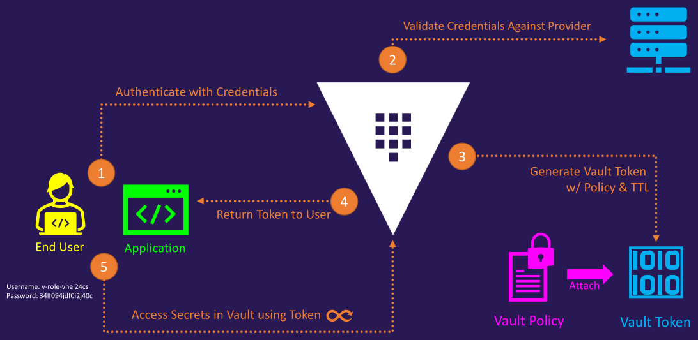
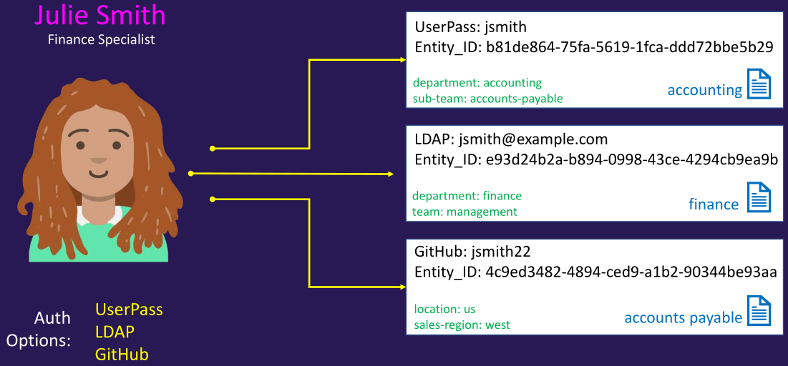
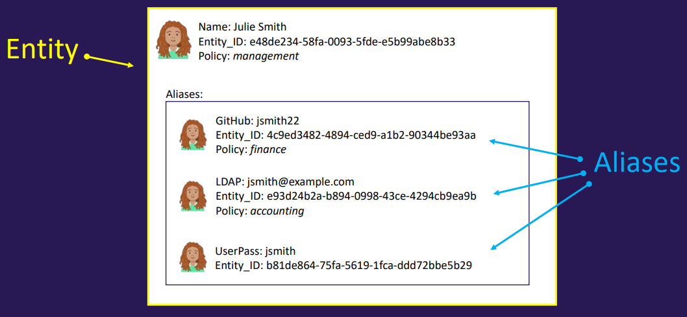
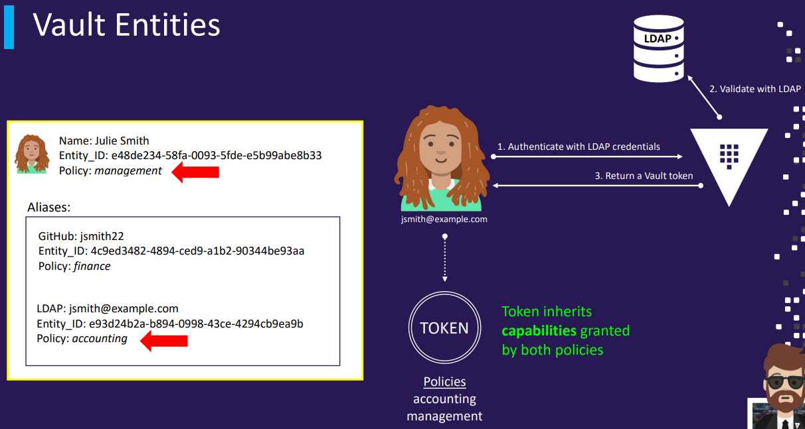
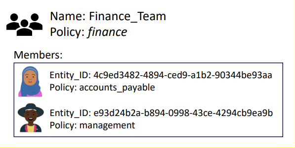

# compare authentication methods

## Auth Methods Overview

## Intro to Auth Methods

Overview

- Performing authentication and managing identities
- Assigning identities and associated policies to users
- Supporting multiple methods tailored to specific use cases
  - Human-oriented: e.g., LDAP, OIDC
  - System-oriented: e.g., AppRole, AWS
- Once authenticated, Vault issues a client token used for all subsequent requests (e.g., read/write operations)
  - The primary goal of all authentication methods is to obtain a token
  - Each token is linked to one or more policies and has a time-to-live (TTL)

Tokens in Vault

- Tokens are the core authentication mechanism in Vault
  - Most Vault operations require a valid token
- The token auth method creates and manages tokens
  - Enabled by default and cannot be disabled
  - External authentication (e.g., LDAP, OIDC) generates a Vault token
- If a token is not provided for non-authentication requests, Vault returns a 403 Access Denied error without redirects or hints

Workflow



## Working with Auth Methods

Key features

- Most auth methods must be explicitly enabled before use
- Multiple auth methods can coexist, often serving distinct purposes (e.g., applications vs. human users)
- The token auth method is always enabled
  - A new Vault deployment relies on a root token for initial authentication
  - It cannot be disabled or replaced as the sole method in a fresh setup

Auth methods can be enabled, disabled, or configured via

- Vault UI (limited functionality compared to CLI/API)
- Vault API
- Vault CLI

Requirement

- A valid token with sufficient privileges is needed to manage auth methods

Path configuration

- Each auth method is enabled at a specific path
  - Custom paths can be set when enabling the method (only at creation)
  - If unspecified, the default path matches the method type (e.g., aws for AWS, approle for AppRole)

## Configuring Auth Methods using the CLI - Done

CLI commands for authentication

- Enabling and disabling auth methods

```bash
vault auth enable approle
---
Success! Enabled approle auth method at: approle/
---

vault auth disable approle
---
Success! Disabled the auth method (if it existed) at: approle/
---

vault auth list
---
Path           Type      Accessor             Description
----           ----      --------             -----------
bryan/         approle   auth_approle_d8c20abe n/a
token/         token     auth_token_89ce3371  token-based credentials
vault-course/  approle   auth_approle_b3f0c92d n/a
```

- Custom paths and descriptions

```bash
vault auth enable approle
---
Success! Enabled approle auth method at: approle/
---

vault auth enable –path=vault-course approle
---
Success! Enabled approle auth method at: vault-course/
---

vault auth enable –path=apps –description="MyApps" approle

vault auth disable apps
```

Configuring auth methods

- Syntax

```bash
vault write auth/<path_name>/<option>
```

- Example

```bash
vault write auth/approle/role/vault-course \
  secret_id_ttl=10m \
  token_num_uses=10 \
  token_ttl=20m \
  token_max_ttl=30m \
  secret_id_num_uses=40
```

## Configuring Auth Methods using the API - checking

Vault offers a fully-featured API intended for machine-to-machine interaction

Critical components of an API request that need to be included:

- The request type (GET, POST, DELETE)
- The appropriate headers (X-Vault-Token, Authorization, X-Vault-Namespace)
- The data (if required)
- The API endpoint (what Vault component you're working with)

HTTP API - Where do i need a token?

- Using an Auth Method: When you are authenticating to Vault via API, you do not need to specify a token (because you haven't retrieved one yet)
- Configure Auth Method: When you are enabling, configuring, or disabling an auth method, you do need to provide a token with the appropriate permissions

Enaling an auth method

- Method: POST

```bash
curl \
--header "X-Vault-Token: s.v2otcpHygZHWiD7BQ7P5aJjL" \
--request POST \
--data '{"type": "approle"}' \  # Can point to a file --data @data.json
https://vault.example.com:8200/v1/sys/auth/approle # API endpoint
```

## Vault Authentication using the CLI - done, not grammar

There are a few ways to authenticate to Vault when using the CLI

Use the vault login command

- Authenticate using a token or another auth method
- Makes use of a token helper

```bash
# Use a "token" method
vault login s.fhNBot4hRBfDWJ2jBdTwimaG
---
Success! You are now authenticated. The token information displayed below is
already stored in the token helper. You do NOT need to run "vault login" again.
Future Vault requests will automatically use this token.
Key Value
--- -----
token s.fhNBot4hRBfDWJ2jBdTwimaG
token_accessor 502YCRmp1SfZ8YCdfbYeS9fj
token_duration ∞
token_renewable false
token_policies ["root"]
identity_policies []
policies ["root"]
---

# Used to obtain a token
vault login -method=userpass username=bryan
---
Password (will be hidden):
Success! You are now authenticated. The token information displayed below
is already stored in the token helper. You do NOT need to run "vault login"
again. Future Vault requests will automatically use this token.
Key Value
--- -----
token s.jgSgKqDOnaOxu30ffC0rZWB0
token_accessor SpiJi6bghz4huS8MG4HsLmNp
token_duration 768h
token_renewable true
token_policies ["admin" "default"]
identity_policies []
policies ["admin" "default"]
token_meta_username bryan
---
```

Use the VAULT_TOKEN Environment Variable

- Used if you already have a token

Token Helper


- Caches the token after authentication. Stores the token in a local file so it can be referenced for subsequent requests
- Stored in `.vault-token`

Parsing the JSON Response to Obtain the Vault Token

```bash
export VAULT_ADDR="https://vault.example.com:8200"

export VAULT_FORMAT=json

OUTPUT=$(vault write auth/approle/login role_id="12345657" secret_id="1nv84nd3821s")

VAULT_TOKEN=$(echo $OUTPUT | jq '.auth.client_token' -j)

vault login $VAULT_TOKEN
```

- Authentication requests to the Vault HTTP API return a JSON response that include:
  - the token
  - the token accessor
  - information about attached policies
- It is up to the user to parse the response for the token and use that token for any subsequent requests to Vault

Authenticating with an auth method

- Method: POST
- Response: JSON

```bash
curl \
--request POST \
--data @auth.json \
https://vault.example.com:8200/v1/auth/approle/login

"request_id": "0f874bea-16a6-c3da-8f20-1f2ef9cb5d22",
"lease_id": "",
"renewable": false,
"lease_duration": 0,
"data": null,
"wrap_info": null,
"warnings": null,
"auth": {
"client_token": "s.wjkffdrqM9QYTOYrUnUxXyX6",
"accessor": "Hbhmd3OfVTXnukBv7WxMrWld",
"policies": [
"admin",
"default"
Service Token
],
```

## Vault Entities

Key features

- Vault creates an entity and attaches an alias to it if a corresponding entity doesn't already exist
  - This is done using the Identity secrets engine, which manages internal identities that are recognized by Vault
- An entity is a representation of a single person or system used to log into Vault. Each has a unique value. Each entity is made up of zero or more aliases
- Alias is a combination of the auth method plus some identification. It is a mapping between an entity and auth method(s)




- An entity can be manually created to map multiple entities for a single user to provide more efficient authorization management
- Any tokens that are created for the entity inherit the capabilities that are granted by alias(es).



Flow



## Vault Identity Groups - done, not grammar

Key features

- A group can contain multiple entities as its members
- A group can also have subgroups.
- Policies can be set on the group and the permissions will be granted to all members of the group.




- Internal group: Groups created in Vault to group entities to propagate identical permissions
  - Created manually
- External group: Groups which Vault infers and creates based on group associations coming from auth methods
  - Created manually or automatically


- Internal groups can be used to easily manage permissions for entities
- Frequently used when using Vault Namespaces to propagate permissions down to child namespaces
  - Helpful when you don't want to configure an identical auth method on every single namespace


- External groups are used to set permissions based on group membership from an external identity provider, such as LDAP, Okta, or OIDC provider
- Allows you to set up once in Vault and continue manage permissions in the identity provider.
  - Note that the group name must match the group name in your identity provider

## Choosing an Auth Method

When selecting an authentication method, consider the following key factors and their implications

- Frequently rotated
  - Typically refers to dynamic credentials that are regularly updated
  - Meets the requirements: AWS, LDAP, Azure, GCP (Google Cloud Platform), Kubernetes (K8s)
  - Does not meet the requirements: Userpass, TLS Certificates, AppRole
- Remove secrets from process or build pipeline
  - Generally indicates the use of dynamic or integrated credentials to eliminate hardcoded secrets
  - Meets the requirements: AWS, Azure, GCP (Google Cloud Platform), Kubernetes (K8s)
  - Does not meet the requirements: Userpass, LDAP
- Use Existing User Credentials
  - Typically means integrating with an existing identity provider to leverage current user credentials
  - Meets the Requirement: OIDC (OpenID Connect), LDAP, Okta, GitHub
  - Does Not Meet the Requirements: Userpass, AWS, Azure, GCP (Google Cloud Platform)

## Differentiate Human vs System Auth Methods

Vault supports a wide variety of authentication methods, which can be broadly categorized into those designed for human-based authentication and those intended for machine-to-machine (system-based) authentication

Human-based auth methods

- Integrates with an existing identity provider
- Requires a hands-on approach to use
- Involves logging in via a prompt or pop-up
- Often configured with the platform’s integrated multi-factor authentication (MFA)
- Example: GitHub, JWT/OIDC, Okta, RADIUS, Userpass

System-based auth emthods

- UUtilizes methodologies that are not human-friendly (e.g., difficult-to-remember credentials)
- Typically integrates with an existing platform
- Vault validates credentials directly with the platform
- Example: AWS, Tokens, Cloud Foundry, TLS Certificates, Kerberos, Microsoft Azure, AppRole, Oracle Cloud, GCP (Google Cloud Platform), Alibaba Cloud, Kubernetes (K8s)

## Demo

### Configuring Auth Methods using the API

### Vault Authentication using the CLI

### Vault Authentication using the API

### Vault Authentication using the UI

### AppRole Auth Method

### Okta Auth Method

### UserPass Auth Method

## Lab

### Working with Auth Methods
