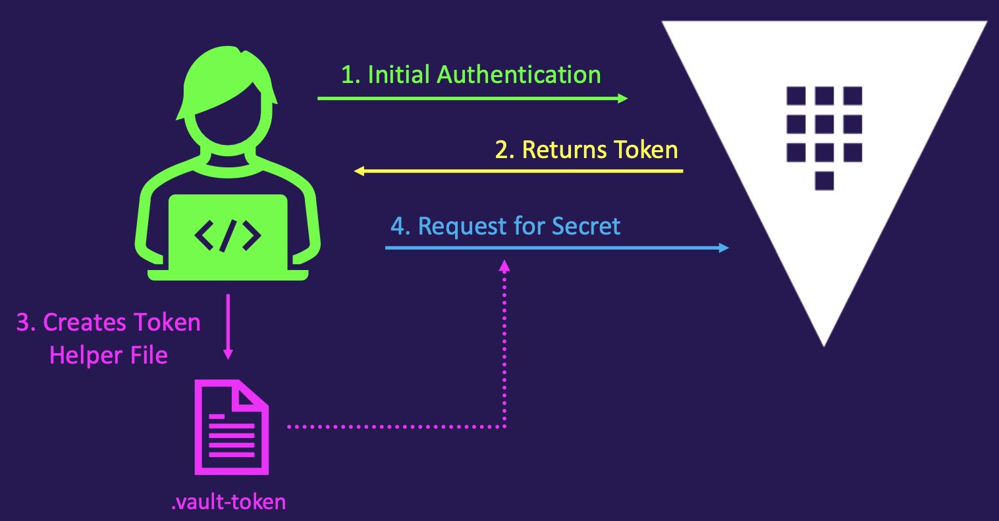
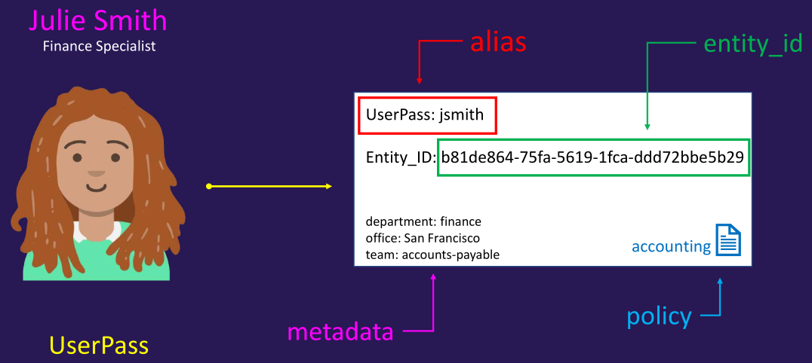
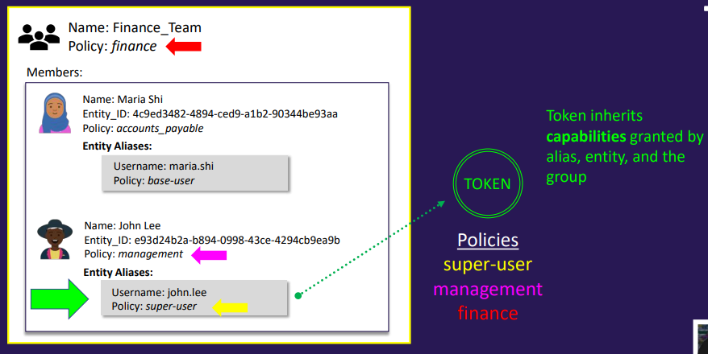
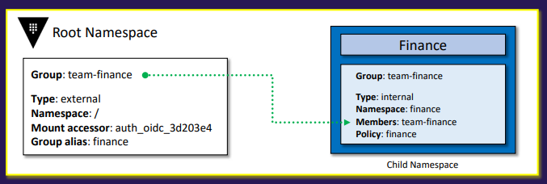

# compare authentication methods

## Intro to Auth Methods

Key features

- Performing authentication and managing identities
- Assigning identities and associated policies to users
- Supporting multiple methods tailored to specific use cases
  - Human-oriented: e.g., LDAP, OIDC
  - System-oriented: e.g., AppRole, AWS
- Once authenticated, Vault issues a client token used for all subsequent requests (e.g., read/write operations)
  - The primary goal of all authentication methods is to obtain a token
  - Each token is linked to one or more policies and has a time-to-live (TTL)

Tokens in Vault

- Tokens are the core authentication mechanism in Vault
  - Most Vault operations require a valid token
- The token auth method creates and manages tokens
  - Enabled by default and cannot be disabled
  - External authentication (e.g., LDAP, OIDC) generates a Vault token
- If a token is not provided for non-authentication requests, Vault returns a 403 Access Denied error without redirects or hints

Workflow


## Working with Auth Methods

Key features

- Most auth methods must be explicitly enabled before use
- Multiple auth methods can coexist, often serving distinct purposes (e.g., applications vshuman users)
- The token auth method is always enabled
  - A new Vault deployment relies on a root token for initial authentication
  - It cannot be disabled or replaced as the sole method in a fresh setup

Auth methods can be enabled, disabled, or configured via

- Vault UI (limited functionality compared to CLI/API)
- Vault API
- Vault CLI

Requirement

- A valid token with sufficient privileges is needed to manage auth methods

Path configuration

- Each auth method is enabled at a specific path
  - Custom paths can be set when enabling the method (only at creation)
  - If unspecified, the default path matches the method type (e.g., aws for AWS, approle for AppRole)

```bash
vault auth enable approle
---
Success! Enabled approle auth method at: approle/
```

## Configuring Auth Methods using CLI

Use the vault auth comamnd

- enable
- disable
- list
- tune
- help

CLI commands for authentication

- Enabling and disabling auth methods

```bash
vault auth enable approle
---
Success! Enabled approle auth method at: approle/

vault auth disable approle
---
Success! Disabled the auth method (if it existed) at: approle/

vault auth list
---
Path           Type      Accessor             Description
----           ----      --------             -----------
kyphan/         approle   auth_approle_d8c20abe n/a
token/         token     auth_token_89ce3371  token-based credentials
vault-course/  approle   auth_approle_b3f0c92d n/a
```

- Custom paths and descriptions
  - Enable
    - Syntax: `vault <object_type> <subcommand> <customize> <description> <method_type>`
  - Disable
    - Syntax: `vault <object_type> <subcommand> <object_path>`

```bash
vault auth enable approle
---
Success! Enabled approle auth method at: approle/

vault auth enable -path=vault-course approle
---
Success! Enabled approle auth method at: vault-course/

vault auth enable -path=apps -description="MyApps" approle

vault auth disable apps
```

Configuring auth methods

- Syntax: `vault write auth/<path_name>/<option>`

```bash
vault write auth/approle/role/vault-course \
  secret_id_ttl=10m \
  token_num_uses=10 \
  token_ttl=20m \
  token_max_ttl=30m \
  secret_id_num_uses=40
```

## Configuring Auth Methods using API

Vault provides a fully-featured API designed for machine-to-machine interaction

Critical components of an API request that need to be included

- Request Type: GET, POST, or DELETE
- Headers: Appropriate headers such as X-Vault-Token, Authorization, or X-Vault-Namespace
- Data: Included if required by the request
- API Endpoint: Specifies the Vault component being interacted with

HTTP API: When is a token required?

- Using an Auth Method: When authenticating to Vault via the API, a token is not required because authentication generates a new token
- Configuring an Auth Method: When enabling, configuring, or disabling an authentication method, a token with appropriate permissions must be provided

Enabling an authentication method

- Method: POST

```bash
curl \
  --header "X-Vault-Token: s.2kjqZ12ofDr3efPdtMJ1z5dZ" \
  --request POST \
  --data '{"type": "approle"}' \  # Can reference a file, e.g., --data @data.json
  https://vault.example.com:8200/v1/sys/auth/approle  # API endpoint
```

## Vault Authentication using CLI

Vault offers several ways to authenticate via the command-line interface (CLI)

Using the vault login command

- Authenticate using a token or another authentication method
- Utilizes a token helper to store the token
- Syntax: `vault login -method=<method_type> <argument>`

Example: Token-based authentication

```bash
vault login <s.2kjqZ12ofDr3efPdtMJ1z5dZ>
---
Success! You are now authenticated. The token information displayed below is
already stored in the token helper. You do NOT need to run "vault login" again
Future Vault requests will automatically use this token

Key                  Value
---                  -----
token                s.2kjqZ12ofDr3efPdtMJ1z5dZ
token_accessor       502YCRmp1SfZ8YCdfbYeS9fj
token_duration       ∞
token_renewable      false
token_policies       ["root"]
identity_policies    []
policies             ["root"]
```

Example: Userpass authentication

```bash
vault login -method=userpass username=kyphan
---
Password (will be hidden)
Success! You are now authenticated. The token information displayed below
is already stored in the token helper. You do NOT need to run "vault login"
again. Future Vault requests will automatically use this token

Key                  Value
---                  -----
token                s.2kjqZ12ofDr3efPdtMJ1z5dZ
token_accessor       SpiJi6bghz4huS8MG4HsLmNp
token_duration       768h
token_renewable      true
token_policies       ["admin", "default"]
identity_policies    []
policies             ["admin", "default"]
token_meta_username  kyphan
```

Use the VAULT_TOKEN environment variable

- Use this method if you already have a token

Token Helper



- Caches the token after authentication and stores it in a local file - `.vault-token` for use in subsequent requests

Parsing the JSON response to obtain the Vault token

```bash
export VAULT_ADDR="https://vault.example.com:8200"

export VAULT_FORMAT=json

OUTPUT=$(vault write auth/approle/login role_id="12345657" secret_id="1nv84nd3821s")

VAULT_TOKEN=$(echo "$OUTPUT" | jq '.auth.client_token' -j)

vault login "$VAULT_TOKEN"
```

## Vault Authentication using API

Authentication requests to the Vault HTTP API return a JSON response that include

- The token
- The token accessor
- Information about attached policies

Users must parse the response to extract the token and use it for subsequent Vault requests

Authenticating with an authentication method

- Data: role_id, secret_id, etc.
- Method: POST
- Response: JSON

```bash
curl \
  --request POST \
  --data @auth.json \
  https://vault.example.com:8200/v1/auth/approle/login
---
{
  "request_id": "0f874bea-16a6-c3da-8f20-1f2ef9cb5d22",
  "lease_id": "",
  "renewable": false,
  "lease_duration": 0,
  "data": null,
  "wrap_info": null,
  "warnings": null,
  "auth": {
    "client_token": "s.wjkffdrqM9QYTOYrUnUxXyX6",
    "accessor": "Hbhmd3OfVTXnukBv7WxMrWld",
    "policies": ["admin", "default"],
    "metadata": {}
  }
}
```

## Vault Entities

Key features

- Vault creates an entity and attaches an alias to it if a corresponding entity does not already exist
  - This is managed through the identity secrets engine, which oversees internal identities recognized by Vault
- An entity represents a single person or system that logs into Vault. Each entity has a unique identifier and consists of zero or more aliases
- An alias is a combination of an authentication method and an identifier. It serves as a mapping between an entity and one or more authentication methods




- Entities can be manually created to consolidate multiple aliases for a single user, enabling more efficient authorization management
- Tokens created for an entity inherit the capabilities granted by its associated alias(es)


Workflow


## Vault Identity Groups

Key features

- A group can include multiple entities as its members
- A group can also contain subgroups
- Policies applied to a group grant permissions to all its members




Types of groups

- Internal group
  - Groups created within Vault to organize entities and propagate identical  permissions
  - Created manually
  - Simplify permission management for entities
  - They are commonly used with Vault Namespaces to propagate permissions to child namespaces
    - This is particularly useful when you want to avoid configuring identical authentication methods for every namespace



- External group
  - Groups that Vault infers and creates based on group associations from authentication methods
  - Created manually or automatically
  - External groups allow permissions to be set based on group membership from an external identity provider, such as LDAP, Okta, or an OIDC provider
  - This enables a one-time setup in Vault, with ongoing permission management handled in the identity provider
    - Note: The group name in Vault must match the group name in the identity provider


## Choosing an Auth Method

When selecting an authentication method, consider the following key factors and their implications

- Frequently rotated
  - Typically refers to dynamic credentials that are regularly updated
  - Meets the requirements: AWS, LDAP, Azure, GCP (Google Cloud Platform), Kubernetes (K8s)
  - Does not meet the requirements: Userpass, TLS Certificates, AppRole
- Remove secrets from process or build pipeline
  - Generally indicates the use of dynamic or integrated credentials to eliminate hardcoded secrets
  - Meets the requirements: AWS, Azure, GCP (Google Cloud Platform), Kubernetes (K8s)
  - Does not meet the requirements: Userpass, LDAP
- Use existing user credentials
  - Typically means integrating with an existing identity provider to leverage current user credentials
  - Meets the Requirement: OIDC (OpenID Connect), LDAP, Okta, GitHub
  - Does not meet the requirements: Userpass, AWS, Azure, GCP (Google Cloud Platform)

## Differentiate Human vs System Auth Methods

Vault supports a wide variety of authentication methods, which can be broadly categorized into those designed for human-based authentication and those intended for machine-to-machine (system-based) authentication

Human-based auth methods

- Integrates with an existing identity provider
- Requires a hands-on approach to use
- Involves logging in via a prompt or pop-up
- Often configured with the platform's integrated multi-factor authentication (MFA)
- Example: GitHub, JWT/OIDC, Okta, RADIUS, Userpass

System-based auth emthods

- Utilizes methodologies that are not human-friendly (e.g., difficult-to-remember credentials)
- Typically integrates with an existing backend platform
- Vault validates credentials directly with the platform
- Example: AWS, Tokens, Cloud Foundry, TLS Certificates, Kerberos, Microsoft Azure, AppRole, Oracle Cloud, GCP (Google Cloud Platform), Alibaba Cloud, Kubernetes (K8s)

## Demo

### Configuring Auth Methods using CLI

```bash
vault auth -h

vault auth enable userpass

vault auth list

vault auth enable -path=vault-course userpass

vault auth list

vault auth disable userpass

vault auth list

vault disable vault-course

vault auth enable -path=kyphan -description="local credentials for Vault" userpass

vault auth list

vault auth tune -default-lease-ttl=24h kyphan/

vault write auth/kyphan/users/andy password=vault policies=kyphan

vault list auth/kyphan/users/andy

vault read auth/kyphan/users/andy

vault auth enable approle

vault write auth/approle/role/kyphan token_ttl=20m policies=kyphan
```

### Configuring Auth Methods using API

```bash
curl \
  --header "X-Vault-Token: s.2kjqZ12ofDr3efPdtMJ1z5dZ" \
  --request POST \
  --data @auth.json \
  http://127.0.0.1:8200/v1/sys/auth/approle

vault auth list

curl \
  --header "X-Vault-Token: s.2kjqZ12ofDr3efPdtMJ1z5dZ" \
  --request POST \
  --data @policies.json \
  http://127.0.0.1:8200/v1/auth/approle/role/vaultcourse

curl \
  --header "X-Vault-Token: s.2kjqZ12ofDr3efPdtMJ1z5dZ" \
  http://127.0.0.1:8200/v1/auth/approle/role/vaultcourse/role-id | jq

curl \
  --header "X-Vault-Token: s.2kjqZ12ofDr3efPdtMJ1z5dZ" \
  -- request POST \
  http://127.0.0.1:8200/v1/auth/approle/role/vaultcourse/secret-id | jq
```

### Configuring Auth Methods using UI

Directions: Homepage &rarr; Access &rarr; Enable new method

```bash
vault login -method=username username=kyphan password=kp123
```

### Vault Authentication using CLI

```bash
vault login -method=okta username=kyphan@gmail.com password=kp123

vault auth enable aws

vault auth disable aws

vault policy list

vault write auth/approle/roles/login role_id=asd123 secret_id=qwe123

vault login -method=userpass username=kyphan password=kp123
```

### Vault Authentication using API

```bash
curl \
  --request POST \
  --data @password.json \
  http://1270.0.0.1:8200/v1/auth/okta/login/kyphan@andy.io | jq

curl \
  --header "X-Vault-Token: s.2kjqZ12ofDr3efPdtMJ1z5dZ" \
  http://127.0.0.1:8200/v1/secret/data/app01 | jq
```

### Vault Authentication using UI

Directions: Homepage &rarr; Profile

```bash
vault login <token>

export VAULT_TOKEN=s.2kjqZ12ofDr3efPdtMJ1z5dZ
```

### AppRole Auth Method

Setup

```bash
vault auth list

vault auth enable approle

vault write auth/approle/role/kyphan pocilies=kyphan token_ttl=20m

vault list auth/approle/role

vault read auth/approle/role/kyphan/role-id

vault write -f auth/approle/role/kyphan/secret-id
```

Login

```bash
vault write auth/approle/login role_id=<role_id> secret_id=<secret_id>
```

### Okta Auth Method

Setup

- Directions: Homepage &rarr; Security &rarr; API &rarr; Tokens &rarr; Create Token

```bash
vault auth enable okta

vault auth list

vault write auth/okta/config base_url="okta.com" org_name="kyphan" api_token="<token>"

vault read auth/okta/config

vault write auth/okta/users/andy@kyphan.io policies=kyphan
```

Login via UI

- Method: Okta
- Username: andy@kyphan.io
- Password: `<okta_password>`

Login via CLI

```bash
vault login -method=okta username=andy@kyphan.io
```

### UserPass Auth Method

Setup

```bash
vault auth list

vault auth enable userpass

vault write auth/userpass/users/kyphan password=kp policies=kyphan

vault write auth/userpass/users/kyphann password=kpp policies=kyphan

vault list auth/userpass/users

vault read auth/userpass/users/kyphan
```

Login

```bash
vault login -method=userpass username=kyphan password=kp

vault login -method=userpass username=kyphann password=kpp
```

## Lab

### Working with Auth Methods - Later
