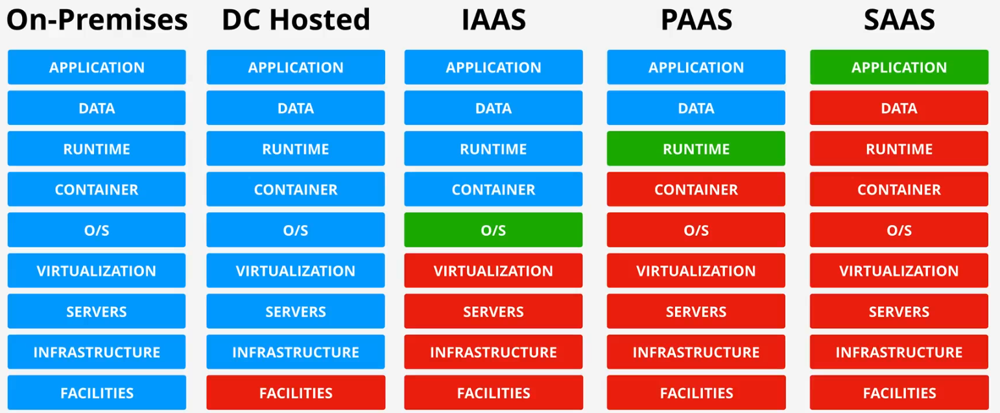

# cloud computing

## Definition

NIST - 5 characteristics

- On-demand self-service
  - Can provision capabilities as needed without requiring human interaction
  - Provision and terminate using a UI/CLI without human interaction
- Broad network access
  - Capabilities are available over the network and accessed through standard mechanisms
  - Access services over any networks, on any devices, using standard protocols and methods
- Resource pooling
  - There is a sense of location independence, no control or knowledge over the exact location of the resources
  - Resources are pooled to serve multiple consumers using a multi-tenant model
  - Economies of scale, cheaper service
- Rapid elasticity
  - Capabilities can be elastically provisioned and released to scale rapidly outward and inward with demand
  - To the consumer, the capabilities available for provisioning often appear to be unlimited
  - Scale up (out) and down (in) automatically in response to system load
- Measured service
  - Resource usage can be monitored, controlled, reported, and billed
  - Usage is measured. Pay for what you consume

## Public vs Private vs Hybrid vs Multi Cloud

Public cloud

- Using 1 public cloud

Private cloud

- Using an on-premises real cloud

Multi-cloud

- Using more than 1 public cloud

Hybrid cloud

- Using both public and private clouds
- Not public cloud + legacy on-premises

:::note
Public cloud and private cloud must meet the 5 essential characteristics of cloud computing
:::

## Cloud Service Models

- Blue: managed by the user
- Red: managed by the vendor
- Green: unit of consumption

Terms and concepts

- Infrastructure stack
- Parts you manage
- Parts managed by the vendor
- Unit of consumption

Stacks layers

- Facilities: building, physical security, power, air conditioner, staffing
- Infrastructure: storage, networking, compute resources
- Servers: physical hardware
- Virtualization: servers run virtualization software, such as VMware, Hyper-V, etc.
- Operating system: virtual machines run an operating system (OS)
- Container: the OS runs containers, such as Docker, etc.
- Runtime: the environment (e.g., Python, Java, etc.) required for the application to run
- Data: data required to run the application
- Application: the software or application itself
