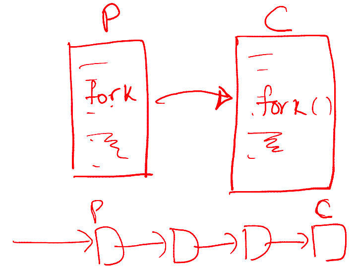
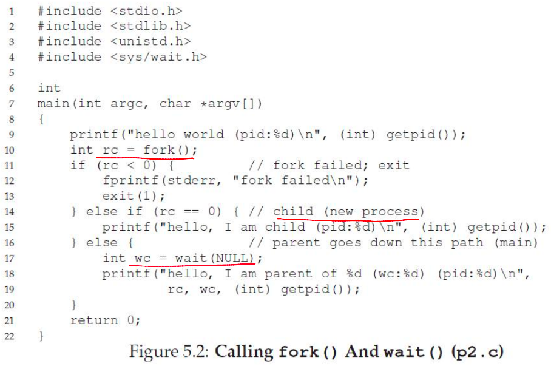
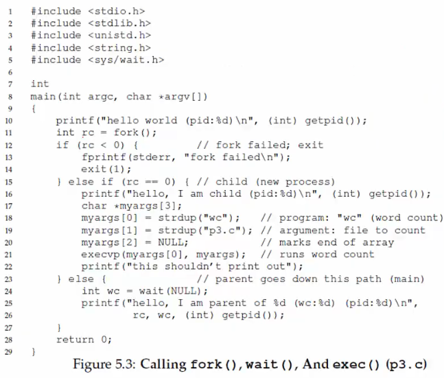
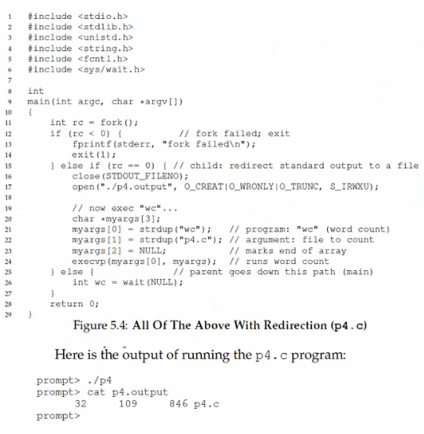
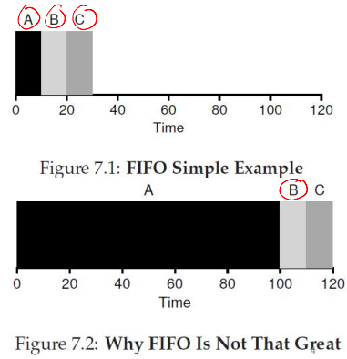
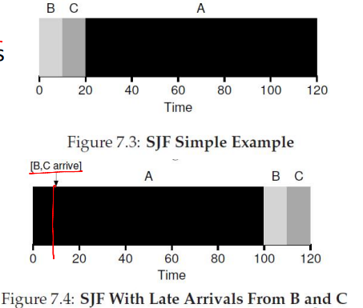
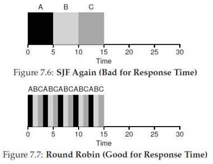

# processes

## Introduction

### What Is an Operating System?

What is an operating system?

- Middleware between programs and system hardware
- Manages hardware: CPU, main memory, I/O devices (disk, network card, mouse, keyboard, etc.)

Key features when running a program

- A compiler translates high-level programs into an executable (".c" - source code to "a.out" - on disk)
- The executable contains
  - Instructions that the CPU can understand
  - Data of the program (all numbered with addresses)
- Instructions run on CPU: Hardware implements an Instruction Set Architecture (ISA)
- CPU also consists of a few registers
  - Program Counter (PC): Points to the next instruction to be executed
  - Operands of instructions, memory addresses

### What Happens When You Run a Program?


- To run an executable, CPU will
  - Fetch instruction pointed at by PC from memory
  - Load data required by the instructions into registers
  - Decode and execute the instruction
  - Store result back to memory

Most recently used instructions and data are in CPU caches for faster access

### What Does the OS Do?

--

- OS manages program memory
  - Loads program executable (code, data) from disk to memory
- OS manages CPU
  - Initializes program counter (PC) and other registers to begin execution
- OS manages external devices
  - Reads and writes files from disk

### How Does OS Manage CPU?

--

- OS provides the process abstraction
  - Process: A running program
  - OS creates and manages processes
- Each process has the illusion of having the complete CPU, and OS virtualizes CPU
  - At any point in time, we have many processes such as listening to music, browsing the web
- Timeshares CPU between processes
- Enables coordination between processes

### How Does OS Manage Memory?

--

- OS manages the memory of the process: Code, data, stack, heap, etc.
- Each process thinks it has a dedicated memory space for itself, numbering code and data starting from 0 (virtual addresses)
- OS abstracts the details of the actual placement in memory, translates from virtual addresses to actual physical addresses, and returns to the process
  - Each process is not aware of how memory is implemented

### How Does OS Manage Devices?

--

- Device drivers: OS has code to manage disk, network card, and other external devices
- Device driver talks the language of the hardware devices
  - Issues instructions to devices (fetch data from a file)
  - Responds to interrupt events from devices (user has pressed a key on keyboard)
- Persistent data organized as a filesystem on disk

### Goals of OS

--

- Convenience
- Abstraction of detailed hardware resources for user programs
- Efficiency of using CPU, memory, etc.
- Isolation between multiple processes

### History of OS

--

- Started as a library to provide common functionality across programs to
  - Abstract the hardware that can be used across different programs
  - Access devices
- Later, evolved from procedure call to system call
- When a system call is made to run OS code, the CPU executes at a higher privilege level
- Evolved from running a single program to multiple processes concurrently

## Process Abstraction

### What Is It?

--

- When you run an executable file, the OS creates a process - a running program
- OS timeshares CPU across multiple processes, virtualizing the CPU
- OS has a CPU scheduler that picks one of the many active processes to execute on a CPU
- A CPU scheduler contains
  - Policy: Defines which process to run
  - Mechanism: Defines how to "context switch" between processes

### What Constitutes a Process?


- A unique identifier (PID)
- Memory image
  - Code and data (static)
  - Stack and heap (dynamic)
    - Stack: Function calls, local variables, etc.
    - Heap: Dynamically allocated memory
- CPU context: Registers
  - Program counter
  - Current operands
  - Stack pointer
- File descriptors
  - Pointers to open files and devices

### How Does OS Create a Process?


- Allocates memory and creates memory image
  - Loads code and data from disk executable
  - Creates runtime stack and heap
- Opens basic files - STDIN, STDOUT, STDERR
- Initializes CPU registers
  - PC points to first instruction

### States of a Process

States

- Running: Currently executing on CPU
- Ready: Waiting to be scheduled
- Blocked: Suspended, not ready to run
  - Why? Waiting for some event, e.g., process issues a read from disk
  - When is it unblocked? Disk issues an interrupt when data is ready
- New: Being created, yet to run
- Dead: Terminated


- Ready &rarr; Running: The OS scheduler assigns the CPU to the process
- Running &rarr; Ready: The OS takes the CPU away (e.g., time limit reached)
- Running &rarr; Blocked: The process initiates a wait (e.g., starts I/O)
- Blocked &rarr; Ready: The awaited event finishes (e.g., I/O done), making the process runnable again (waiting for the CPU)

Example


### OS Data Structures

--

- OS maintains a data structure (e.g., list) of all active processes
- Information about each process is stored in a process control block (PCB)
  - Process identifier
  - Process state
  - Pointers to other related processes (parent)
  - CPU context of the process (saved when the process is suspended)
  - Pointers to memory locations
  - Pointers to open files

## System Calls for Process Management

### What API Does OS Provide to User Programs?

--

- API = Application Programming Interface
  - Functions available to write user programs
- API provided by OS is a set of "system calls"
  - System call is a function call into OS code that runs at a higher privilege level of the CPU
  - Access to sensitive operations (e.g., access to hardware) is allowed only at a higher privilege level
  - Some "blocking" system calls cause the process to be blocked and descheduled (e.g., read from disk)

### Should We Rewrite Programs for Each OS?

--

- POSIX (Portable Operating System Interface) API: A standard set of system calls that an OS must implement
  - Programs written to the POSIX API can run on any POSIX-compliant OS
  - Most modern OSes are POSIX-compliant
  - Ensures program portability
- Programming language libraries hide the details of invoking/canceling system calls
  - The printf function in the C library calls the write system call to write to the screen
  - User programs usually do not need to worry about invoking system calls

### System Call Processes in Unix

System calls

- fork() creates a new child process
  - All processes are created by forking from a parent
  - The init process is the ancestor of all processes
- exec() makes a process execute a given executable
- exit() terminates a process
- wait() causes a parent to block until the child terminates or waits for a process to finish

Many variants exist of the above system calls with different arguments

### What Happens During a Fork?



- A new process is created by making a copy of the parent's memory image
- The new process is added to the OS process list and scheduled
- Parent and child start execution just after fork (with different return values)
- Parent and child execute and modify the memory data independently


- In the child process, fork() returns 0
- In the parent process, fork() returns the PID of the newly created child process

### Waiting for Child Process to Terminate

--

- Process termination scenarios
  - Normal: By calling exit() (exit is called automatically when the end of the main function is reached)
  - Abnormal: OS terminates a misbehaving process
- Terminated process exists as a zombie - still consumes memory
- When a parent calls wait(), the zombie child is cleaned up or reaped
- What if the parent terminates before the child?
  - init process adopts orphans and reaps them



### What Happens During Exec?

--

- After fork, parent and child are running the same code
  - Not too useful
- A process can run exec() to load another executable into its memory image
- A child can run a different program from the parent
  - Replaces the memory image of the current process (code, data, heap, and stack) with the new program
- Variants of exec(), e.g., to pass command-line arguments to the new executable



### How Does a Shell Work?

--

- In a basic OS, the init process is created after initialization of hardware (on modern systems, systemd or init with PID 1)
- The init process spawns a shell (like bash, zsh, or sh)
- Shell reads user command, forks a child, execs the command executable, waits for it to finish, reads the next command
- Common commands like ls are all executables that are simply exec'ed by the shell

Example with general steps

```bash
ls
---
a.txt b.txt c.txt
```

- Shell reads the command ls
- Shell parses the command and locates the ls
- executable in $PATH (e.g., /bin/ls)
- Shell forks a child process
- Child process calls execve("/bin/ls", ["ls"], [env])
- Parent shell calls waitpid() and pauses
- Child process writes the result to its standard output
- Child process finishes execution and terminates
- Parent shell resumes after waitpid() returns and updates the $? status variable
- Parent shell displays the prompt ($), ready for the next command

### More Funky Things About the Shell

--

- Shell can manipulate the child in strange ways
- Suppose you want to redirect output from a command to a file
- `prompt>ls > foo.txt`
- Shell spawns a child, redirects its standard output to a file using open(), then calls exec on the child




## Process Execution Mechanism

### Process Execution

--

- OS allocates memory and creates memory image
  - Code and data (from executable)
  - Stack and heap
- Points CPU program counter to next instruction
  - Other registers may store operands, return values, etc.
- After setup, OS is out of the way - completed and process executes directly on CPU
- OS is not involved in every single instruction execution

### How a Simple Function Call Works?

Things to recall

- Program Counter (PC) holds the memory address of the next instruction to be executed by the CPU
- Stack Pointer (SP) points to the current top of the stack in memory
- Base Pointer (BP) / Frame Pointer (FP) points to a fixed location within the current stack frame, making access to function arguments, local variables, and other stack frame data easier
- Stack manages function calls, stores temporary data like local variables and return addresses

How a simple function call works in a sequential flow

- When calling
  - A function call (e.g., myFunction()) translates to a specific CPU instruction - CALL
  - The CALL instruction performs two primary, sequential actions
    - It pushes the return address onto the stack - the address in the calling function where execution resumes after the called function finishes
    - PC points to the next instruction (memory address) where the function's code begins
- Inside called function
  - Once execution begins inside the called function, a new stack frame is created on the stack
  - SP points to the top of the stack


### How Is a System Call Different?

--

- CPU hardware has multiple privilege levels
  - One to run user code: User mode
  - One to run OS code like system calls: kernel mode
  - Some instructions execute only in kernel mode
- The kernel does not trust or use the user stack
  - Uses a separate kernel stack when in kernel mode
  - User stack: Each user process has its own stack in user space
  - Kernel stack: When a system call is made, the CPU switches to a separate kernel stack that belongs to the calling process but exists in kernel space
- Kernel does not trust user-provided addresses to jump to
  - Kernel sets up the Interrupt Descriptor Table (IDT) at boot time
  - IDT has addresses of kernel functions to run for system calls and other events

### Trap Instruction

Trap instruction execution steps

- When a system call must be made, a special trap instruction is run (usually hidden from the user by libc)
- Trap instruction execution
  - Move CPU to higher privilege level
  - Switch to kernel stack
  - Save context (old PC, registers) on kernel stack
  - Look up address in IDT and jump to trap handler function in OS code


Triggers for trap instructions and IDT lookup

- Trap instruction is executed on hardware in the following cases
  - System call (program needs OS service)
  - Program fault (program does something illegal, e.g., accesses memory it doesn't have access to)
  - Interrupt (external device needs attention of OS, e.g., a network packet has arrived on network card)
- Across all cases, the mechanism is: Save context on kernel stack and switch to OS address in the IDT
- IDT has many entries/functions, which to use?
  - System calls/interrupts store a number in a CPU register before calling trap, to identify which IDT entry to use

Return from trap and exit kernel mode

- When OS is done handling syscall or interrupt, it calls a special instruction - return-from-trap
  - Restore context of CPU registers from kernel stack
  - Change CPU privilege from kernel mode to user mode
  - Restore PC and jump to user code after trap
- User process unaware that it was suspended, resumes execution as normal
- Will you always return to the same user process from kernel mode? No
- Before returning to user mode, the OS checks whether it should continue running the same process or switch to another process

### Why Switch Between Processes?

--

- Sometimes when the OS is in kernel mode, it cannot return to the same process it left
  - Process has exited or must be terminated (e.g., segfault)
  - Process has made a blocking system call (e.g., reading data from disk, waiting for network input, waiting for a timer)
    - The process transfers control to the kernel to handle the request
    - The kernel starts the operation
    - The kernel blocks the process while operating &rarr; the process is in waiting or blocked state &rarr; the process cannot use the CPU
    - A context switch is performed by OS to select another process from the "ready" queue to run on the CPU
    - After finishing the operation, the kernel updates process state from "blocked" to "ready"
- Sometimes, the OS does not want to return to the same process
  - The process has run for too long
  - Must timeshare CPU with other processes
- In such cases, OS performs a context switch to switch from one process to another

### The OS Scheduler

--

- OS scheduler has two parts
  - Policy to pick which process to run
  - Mechanism to switch to that process
- Non-preemptive (cooperative) schedulers are polite
  - Switch only if process cannot run - blocked or terminated
- Preemptive (non-cooperative) schedulers can switch even when process is ready to continue
  - CPU generates periodic timer interrupt
  - After servicing interrupt, OS checks if the current process has run for too long

### Mechanism of Context Switch

Example: Process A has moved from user to kernel mode, OS decides it must switch from A to B

- Save context (PC, registers, kernel stack pointer) of A on kernel stack
- Switch SP to kernel stack of B
- Restore context from B's kernel stack
  - Who has saved registers on B's kernel stack?
    - OS did, when it switched out B in the past
- Now, CPU is running B in kernel mode, return-from-trap to switch to user mode of B

### A Subtlety on Saving Context

--

- Context (PC and other CPU registers) saved on the kernel stack in two different scenarios
- When going from user mode to kernel mode, user context (e.g., which instruction of user code you stopped at) is saved on kernel stack by the trap instruction
  - Restored by return-from-trap
- During a context switch, kernel context (e.g., where you stopped in the OS code) of process A is saved on the kernel stack of A by the context switching code
  - Restores kernel context of process B

## Scheduling Policies

### What Is a Scheduling Policy?

--

- On context switch, which process to run next, from the set of ready processes?
- OS scheduler schedules the CPU requests (bursts) of processes
  - CPU burst = the CPU time used by a process in a continuous stretch
  - If a process comes back after I/O wait, it counts as a fresh CPU burst

### What Are We Trying to Optimize?

--

- Maximize (utilization = fraction of time CPU is used)
- Minimize average (turnaround time = time from a process's arrival to completion) 
- Minimize average (response time = time from a process's arrival to first scheduling)
- Fairness: All processes must be treated equally
- Minimize overhead: Run process long enough to amortize (reduce) cost of context switch (~1 microsecond)

### First-in-First-Out (FIFO)

FIFO runs processes in arrival order (e.g., A, B, C at t=0) without preemption until completion

- Pros
  - Simple to implement
  - Fair by arrival order
- Cons
  - Convoy effect delays short jobs
  - High turnaround times - (especially for processes arriving later or shorter jobs stuck behind longer ones)



### Shortest Job First (SJF)

SJF runs the shortest job first, non-preemptively, optimal when jobs arrive together

- Pros
  - Minimizes wait time for simultaneous arrivals
  - Efficient for varied job lengths
- Cons
  - Short jobs wait if long job starts
  - Needs accurate job length estimates



### Shortest Time-to-Completion First (STCF)

STCF (or SRTF) preempts for the job with shortest remaining time on new arrivals

- Pros
  - Lowers wait time dynamically
  - Prioritizes near-complete jobs
- Cons
  - High context switch overhead
  - Needs remaining time estimates


### Round Robin (RR)

RR gives each process a fixed time slice, preempting and cycling through a queue

- Pros
  - Fair CPU sharing
  - Good response time for interactive systems
- Cons
  - Poor turnaround for long jobs (frequently interrupted, etc.)
  - Quantum size impacts efficiency (too small increases context switch overhead, too large mimics FIFO behavior)



### Schedulers in Real Systems

--

- Real schedulers are more complex
- For example, Linux uses a Multi-Level Feedback Queue (MLFQ)
  - Many queues, in order of priority
  - Process from the highest priority queue scheduled first
  - Within the same priority, any algorithm like RR
  - Priority of a process decays with its age


## Inter-Process Communication

### Inter-Process Communication (IPC)

--

- Processes do not share any memory with each other
  - Each has its own separate memory
- Some processes might want to work together for a task, so need to communicate information
- IPC mechanisms to share information between processes

### Shared Memory

--

- Processes can both access the same region of memory via shmget()system call
  - int shmget (key_t key, int size, int shmflg)
- By providing the same key, two processes can get same segment of memory
- Can read/write to memory to communicate
- Need to take care that one is not overwriting the other's data. How?

### Signals

--

- A certain set of signals is supported by OS
  - Some signals have fixed meaning (e.g., signal to terminate a process)
  - Some signals can be user-defined
- Signals can be sent to a process by the OS or another process (e.g., if you type Ctrl+C, the OS sends a SIGINT signal to the running process)
- Signal handler: Every process has a default code to execute for each signal
  - Exit on terminate signal
- Some signal handlers can be overridden to do other things

### Sockets

--

- Sockets can be used for two processes on the same machine or different machines to communicate
  - TCP/UDP sockets across machines
  - Unix sockets on the local machine
- Communicating with sockets
  - Processes open sockets and connect them to each other
  - Messages written into one socket can be read from another
  - The OS transfers data across the socket buffer

### Pipes

--

- The pipe system call returns two file descriptors
  - Read handle and write handle
  - A pipe is a half-duplex (one-way) communication
  - Data written in one file descriptor can be read through another
- Regular pipes: Both fds are in same process (how it is useful?)
  - Parent and child share fds after fork
  - Parent uses one end to write and child uses the other end to read
- Named pipes: Two endpoints of a pipe can be in different processes
- Pipe data is buffered in OS buffers between write and read

### Message Queues

--

- Mailbox abstraction
- A process can open a mailbox at a specified location
- Processes can send/receive messages from the mailbox
- The OS buffers messages between send and receive

### Blocking vs Non-Blocking Communication

--

- Some IPC actions can block
  - Reading from socket/pipe that has no data, or reading from empty message queue
  - Writing to a full socket/pipe/message queue
- The system calls to read/write have versions that block or can return with an error code in case of failure
  - A socket read can return an error indicating no data to be read, instead of blocking
