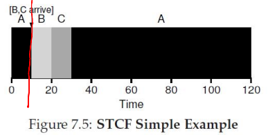

# scheduling policies

## What Is a Scheduling Policy?

--

- On context switch, which process to run next, from the set of ready processes?
- OS scheduler schedules the CPU requests (bursts) of processes
  - CPU burst = the CPU time used by a process in a continuous stretch
  - If a process comes back after I/O wait, it counts as a fresh CPU burst

## What Are We Trying to Optimize?

--

- Maximize (utilization = fraction of time CPU is used)
- Minimize average (turnaround time = time from a process's arrival to completion) 
- Minimize average (response time = time from a process's arrival to first scheduling)
- Fairness: All processes must be treated equally
- Minimize overhead: Run process long enough to amortize (reduce) cost of context switch (~1 microsecond)

## First-in-First-Out (FIFO)

FIFO runs processes in arrival order (e.g., A, B, C at t=0) without preemption until completion

- Pros
  - Simple to implement
  - Fair by arrival order
- Cons
  - Convoy effect delays short jobs
  - High turnaround times - (especially for processes arriving later or shorter jobs stuck behind longer ones)

## Shortest Job First (SJF)

SJF runs the shortest job first, non-preemptively, optimal when jobs arrive together

- Pros
  - Minimizes wait time for simultaneous arrivals
  - Efficient for varied job lengths
- Cons
  - Short jobs wait if long job starts
  - Needs accurate job length estimates

## Shortest Time-to-Completion First (STCF)

STCF (or SRTF) preempts for the job with shortest remaining time on new arrivals

- Pros
  - Lowers wait time dynamically
  - Prioritizes near-complete jobs
- Cons
  - High context switch overhead
  - Needs remaining time estimates

## Round Robin (RR)

RR gives each process a fixed time slice, preempting and cycling through a queue

- Pros
  - Fair CPU sharing
  - Good response time for interactive systems
- Cons
  - Poor turnaround for long jobs (frequently interrupted, etc.)
  - Quantum size impacts efficiency (too small increases context switch overhead, too large mimics FIFO behavior)

## Schedulers in Real Systems

--

- Real schedulers are more complex
- For example, Linux uses a Multi-Level Feedback Queue (MLFQ)
  - Many queues, in order of priority
  - Process from the highest priority queue scheduled first
  - Within the same priority, any algorithm like RR
  - Priority of a process decays with its age
