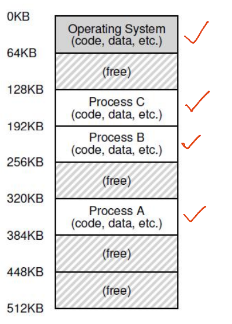
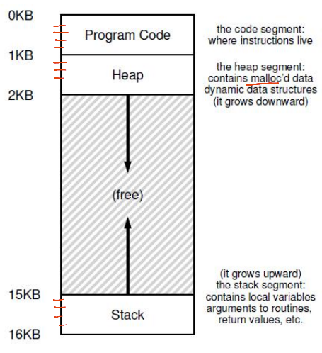

# intro to virtual memory

## Why Virtualize Memory?

--

- Because the real view of memory is messy
- Earlier, memory had only code of one running process (and the OS code)
- Now, multiple active processes timeshare the CPU
  - Memory of many processes
  - Non-contiguous
- Need to hide this complexity from user

- Three processes: Sharing memory

## Abstraction: (Virtual) Address Space

--

- Virtual Address Space: Each process believes it has a large, continuous block of memory, starting from address 0 up to a maximum limit
  - In reality, this memory might not be contiguous or completely available in physical memory (RAM), but the virtual memory system makes it appear so to each process
- Contains program code (and static data), heap (dynamic allocations), and stack (used during function calls)
  - Stack and heap grow during runtime
  - The heap expands downward and the stack grows upward
- CPU issues loads and stores instructions to virtual addresses, which involve reading from and writing to memory

## How is actual memory reached?

Virtual Addresses (VA): These are the addresses that each process thinks it is using, provided by the operating system
- Each process operates within its own virtual address space, which isolates it from other processes and simplifies memory management

Physical Addresses (PA): These refer to the actual locations in the computer’s physical memory (RAM) where data is stored

- Right is VA

Address translation from virtual addresses (VA) to physical addresses (PA)
- CPU issues (phat hien) loads/stores to VA but memory hardware accesses PA
- When the CPU accesses a virtual address (VA), the MMU translates it into a corresponding physical address (PA), and then the memory hardware performs the actual read/write operation on the physical memory
- For example, a virtual address like 100 might be translated by the MMU to a physical address like 1001

OS allocates memory and tracks location of processes (in physical memory) - using page tables

Translation done by memory hardware called Memory Management Unit (MMU)
- OS makes the necessary information available

# a
 7h50 
# b
# Example: Paging

OS divides virtual address space into fixed size pages, physical memory into frames

To allocate memory, a page is mapped to a free physical frame

Page table stores mappings from virtual page number to physical frame number for a process (e.g., page 0 to frame 3)

MMU has access to page tables, and uses it to translate VA to PA

# Goals of memory virtualization

Transparency: User programs should not be aware of the messy details

Efficiency: Minimize overhead and wastage in terms of memory space and access time

Isolation and protection: A user process should not be able to access anything outside its address space

# How can a user allocate memory?

OS allocates a set of pages to the memory image of the process

Within this image:
- Static/global variables are allocated in the executable
- Local variables of a function on stack
- Dynamic allocation with malloc on the heap

# Memory allocation system calls

malloc implemented by C library
- Algorithms for efficient memory allocation and free space management

To grow heap, libc uses the brk/sbrk system call

A program can also allocate a page sized memory using the mmap() system call
- Gets “anonymous” page from OS

# A subtle point: what is the address space of the OS?

OS is not a separate process with its own address space

Instead, OS code is part of the address space of every process

A process sees OS as part of its code (e.g., library)

Page tables map the OS addresses to OS code

# How does the OS allocate memory?

OS needs memory for its data structures

For large allocations, OS allocates a page

For smaller allocations, OS uses various memory allocation algorithms (more later)
- Cannot use libc and malloc in kernel!
Beta
0 / 0
used queries

1