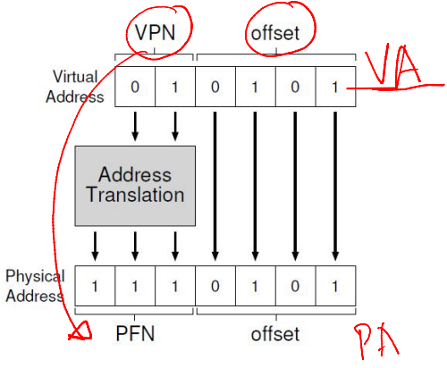

# paging

## Paging

--

- Allocate memory in fixed-size chunks ("pages")
- Avoids external fragmentation (no small "holes")
- Has internal fragmentation (partially filled pages)

## Page Table

--

- Per-process data structure to help VA-PA translation
- An array stores mappings from the virtual page number (VPN) to the physical frame number (PFN)
  - E.g., VP 0 &rarr; PF 3, VP 1 &rarr; PF 7
- Part of OS memory (in PCB)
- MMU has access to the page table and uses it for address translation
- OS updates the page table upon a context switch

## Page Table Entry (PTE)

--

- Simplest page table: Linear page table
- Page table is an array of page table entries, one per virtual page
- VPN (virtual page number) is the index into this array
- Each PTE contains PFN (physical frame number) and a few other bits:
  - Valid bit: Is this page used by the process?
  - Protection bits: Read/write permissions
  - Present bit: Is this page in memory?
  - Dirty bit: Has this page been modified?
  - Accessed bit: Has this page been recently accessed?

## Address Translation in Hardware

--

- Most significant bits of VA give the VPN
- Page table maps VPN to PFN
- PA is obtained from PFN and offset within a page
- MMU stores the physical address of the start of the page table, not all entries
- "Walks" the page table to get the relevant PTE

## What Happens on Memory Access?

--

- The CPU requests code or data at a virtual address
- MMU must translate VA to PA:
  - First, access memory to read the page table entry
  - Translate VA to PA
  - Then, access memory to fetch code/data
- Paging adds overhead to memory access
- Solution? A cache for VA-PA mappings

## Translation Lookaside Buffer (TLB)

- A cache of recent VA-PA mappings
- To translate VA to PA, the MMU first looks up the TLB
- If TLB hit, PA can be directly used
- If TLB miss, the MMU performs additional memory accesses to "walk" the page table
- TLB misses are expensive (multiple memory accesses)
  - Locality of reference helps to have a high hit rate
- TLB entries may become invalid on context switch and change of page tables

## How Are Page Tables Stored in Memory?

--

- What is the typical size of a page table?
  - 32-bit VA, 4 KB pages, so 2^32 / 2^12 = 2^20 entries
  - If each PTE is 4 bytes, then the page table is 4MB
  - One such page table per process!
- How to reduce the size of page tables?
  - Larger pages, so fewer entries
- How does the OS allocate memory for such large tables?
  - Page table is itself split into smaller chunks!

## Multilevel Page Tables (1)

--

- A page table is spread over many pages
- An "outer" page table or page directory tracks the PFNs of the page table pages

## Multilevel Page Tables (2)

--

- Depending on how large the page table is, more than 2 levels may be needed
  - 64-bit architectures may need 7 levels
- What about address translation?
  - First few bits of VA identify the outer page table entry
  - The next few bits index into the next level of PTEs
- In case of TLB miss, multiple accesses to memory are required to access all levels of page tables